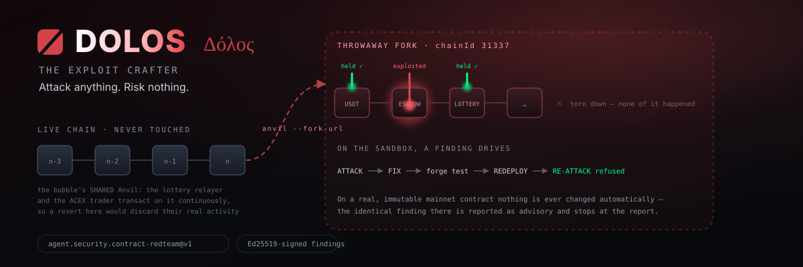
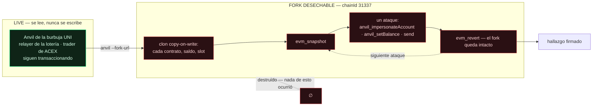
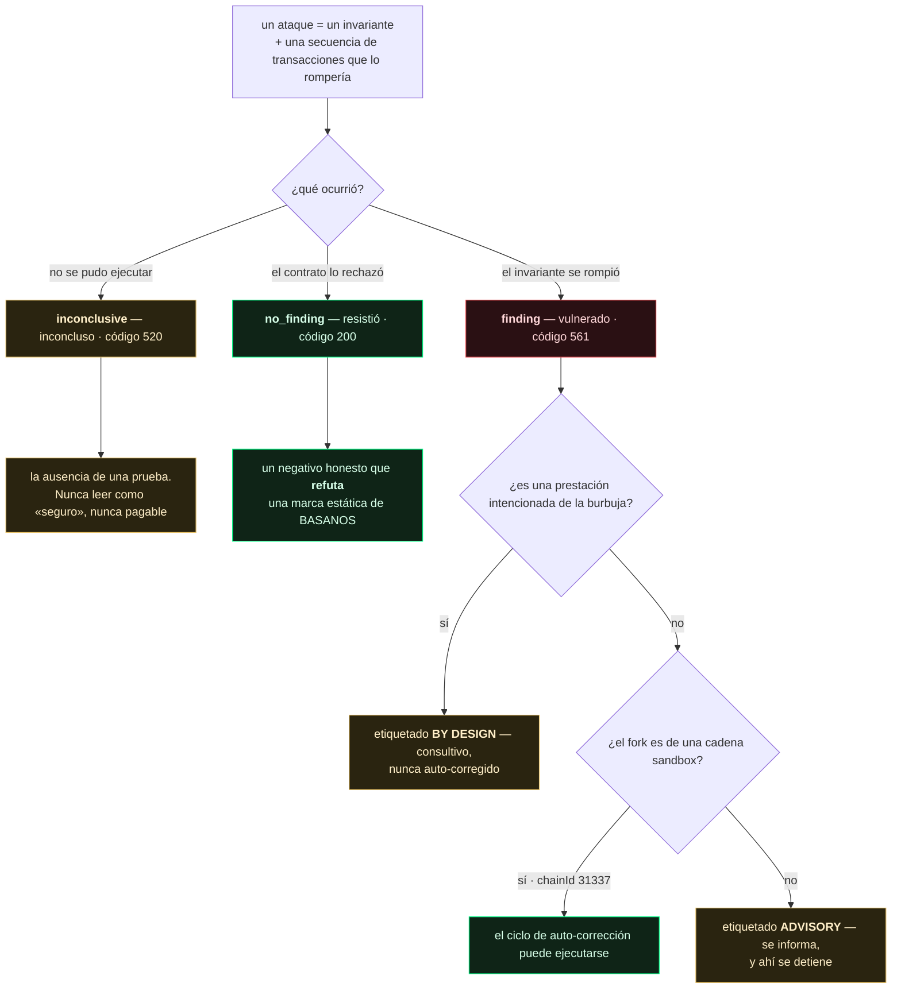
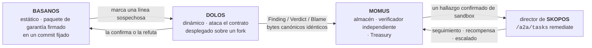
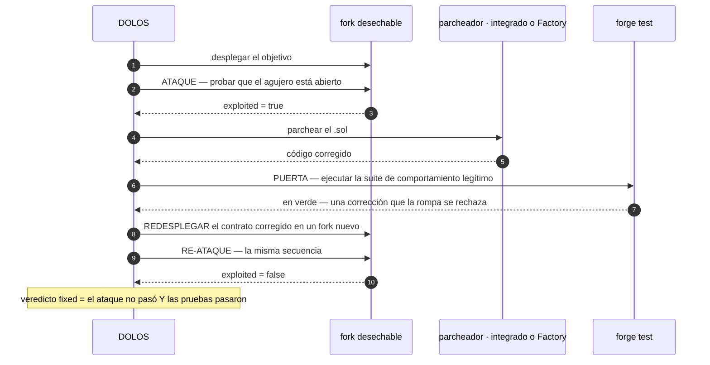

<p align="center"></p>

<h1 align="center">DOLOS — el fabricante de exploits</h1>

<p align="center">
  <strong>DOLOS</strong> (Δόλος) — el espíritu griego del engaño y la astucia.<br>
  Un banco de ataque dinámico de EVM para la burbuja UNI: ataca los contratos desplegados, prueba
  qué fallos son reales y —solo en la cadena sandbox— lleva la corrección hasta un redespliegue
  re-probado.
</p>

<!-- aicom-readme-badges -->
<p align="center">
  <a href="https://github.com/alexar76/dolos/actions/workflows/ci.yml"></a>
  <a href="https://dolos.modelmarket.dev/"></a>
  <a href="https://alexar76.github.io/dolos/"></a>
  =3.11" />
  
  
  
  
  <a href="https://github.com/alexar76/dolos/blob/main/LICENSE"></a>
</p>
<!-- /aicom-readme-badges -->

<p align="center">
  🌐 <a href="README.md">English</a> ·
  <a href="README.ru.md">Русский</a> ·
  <strong>Español</strong> ·
  <a href="README.fr.md">Français</a> ·
  <a href="README.zh.md">中文</a>
</p>

**Capability:** `agent.security.contract-redteam@v1` · **Se ejecuta contra:** el Anvil de la burbuja
UNI (`chainId 31337`) · **Capas hermanas:** [BASANOS](../basanos) (garantía estática) ·
[MOMUS](../momus) (equipo rojo para HTTP/federación)

---

## Contenido

- [Por qué es seguro atacarlo todo](#por-qué-es-seguro-atacarlo-todo)
- [Qué es un ataque](#qué-es-un-ataque)
- [Los tres resultados](#los-tres-resultados)
- [Hallazgos que se integran en el pipeline](#hallazgos-que-se-integran-en-el-pipeline)
- [El ciclo completo de auto-corrección](#el-ciclo-completo-de-auto-corrección)
- [El límite de seguridad — y por qué UNI](#el-límite-de-seguridad--y-por-qué-uni)
- [Uso](#uso)
- [Escaneo periódico, y una memoria](#escaneo-periódico-y-una-memoria)
- [Configuración](#configuración)
- [Pruebas](#pruebas)
- [Un LLM opcional](#un-llm-opcional--y-lo-que-no-se-le-permite-tocar)
- [Inteligencia externa](#inteligencia-externa--leída-de-basanos-nunca-descargada-aquí)
- [Requisitos](#requisitos)
- [Aviso legal](#aviso-legal)

---

## Por qué es seguro atacarlo todo

La forma obvia de probar un contrato es lanzar un exploit contra la cadena en vivo y revertir con
`evm_revert`. En la burbuja UNI eso está mal: su Anvil es **compartido** —el relayer de la lotería y
el trader de ACEX transaccionan en él continuamente, y una reversión descartaría en silencio su
actividad real.

Por eso DOLOS nunca toca la cadena en vivo. Levanta su **propio** `anvil --fork-url <live>`: un clon
copy-on-write del estado en vivo. Cada contrato desplegado, cada saldo y cada slot de almacenamiento
está ahí para ser atacado —financiado con éter falso vía `anvil_setBalance`, manejable **como
cualquier dirección** vía `anvil_impersonateAccount`— y cuando se destruye el fork, nada de lo que
ocurrió en él llegó a existir.



Esa es la propiedad sobre la que descansa todo el diseño: **ataca lo que sea, no arriesgues nada**,
porque el objetivo es un fork, no la burbuja, y nunca una cadena real.

| Cheat code | Qué aporta | Por qué aquí es seguro |
|---|---|---|
| `anvil --fork-url` | un clon copy-on-write del estado en vivo | el objetivo es el clon; la burbuja no se toca |
| `evm_snapshot` / `evm_revert` | reversión total y gratuita entre ataques | lo desechable es el fork, no la burbuja |
| `anvil_impersonateAccount` | transaccionar **como** el dueño o la víctima, sin clave | imposible en una cadena real — de eso se trata |
| `anvil_setBalance` | financiar cualquier dirección con éter falso para gas | nada es real; nada sobrevive al fork |

## Qué es un ataque

No «llamar a una función y ver qué pasa», sino un **invariante** que el contrato afirma y una
secuencia concreta de transacciones que lo rompería:

| Ataque | Invariante | En los contratos UNI reales |
|---|---|---|
| `unauthorized_token_mint` | el suministro solo crece mediante un minter autorizado | **resistió** — FakeUSDT solo hace mint en su constructor |
| `escrow_channel_hijack` | un id de canal abierto no puede ser reabierto por otro llamante | **resistió** — la guarda `depositor != 0` lo rechaza |
| `lottery_operator_bypass` | solo `OPERATOR_ROLE` puede abrir una ronda / retirar comisiones | **resistió** — `onlyRole` se aplica |

Cada ataque lee su propio ABI de la salida de compilación de Foundry, así que toda llamada que hace
es una llamada que el contrato desplegado expone de verdad. Un ABI ausente vuelve el ataque
**inconcluso** — nunca una interfaz inventada y nunca un aprobado por omisión.

## Los tres resultados



El negativo honesto es la razón por la que DOLOS existe junto a BASANOS. BASANOS (estático) marca
*«cualquier llamante puede escribir `channels[<caller id>]`»*; solo intentar de verdad el secuestro y
ser revertido prueba si esa marca es un agujero real o un falso positivo. En los contratos UNI en
vivo DOLOS **refutó** exactamente esa marca: intentó el secuestro, la guarda resistió, y así lo dijo.

## Hallazgos que se integran en el pipeline

Un hallazgo de DOLOS es el mismo documento firmado que emite una sonda de [MOMUS](../momus): la
tríada con forma de AWR **Finding / Verdict / Blame**, firmada con Ed25519 sobre una forma JSON
canónica, compacta y ordenada. Entra directamente en el almacén de MOMUS, su verificador y la
Treasury porque los bytes canónicos son idénticos.



La clave de deduplicación se deriva solo de `target + probe + category + status_code` —
deliberadamente **no** de la respuesta—, así que el mismo bug nunca se paga dos veces, por muchas
veces que se re-escanee.

La firma sigue la separación de funciones del ecosistema: la clave del **escáner** firma el
hallazgo, una clave de verificador **distinta** firma el veredicto, y ninguna de las dos es la clave
de la Treasury que libera un pago. Donde `oracle-core` está instalado, DOLOS firma con el firmante
Ed25519 canónico del ecosistema; donde no, un firmante local respaldado por `cryptography` produce
los mismos bytes.

## El ciclo completo de auto-corrección

Todo sobre un fork sandbox desechable — **sin redespliegue de infraestructura**: solo se vuelve a
desplegar el contrato, y sobre un fork que se tira:



Probado de extremo a extremo en el **DolosCanary** — una bóveda hecha para ser rota (como el canario
de MOMUS y PRAXIS): un desconocido drena 5 ETH que nunca depositó; el reparador inserta una guarda de
saldo; `forge test` sigue en verde (una corrección que rompa los retiros legítimos se rechaza); el
contrato redesplegado rechaza el mismo drenaje; veredicto `fixed`. Los contratos UNI reales
resistieron, así que en ellos no hay nada que corregir — y ese es el resultado correcto, no un vacío.

El reparador es enchufable: el **parcheador integrado** aplica guardas deterministas, o defina
`DOLOS_FACTORY_FIX_URL` para que la **Factory** produzca el parche. Una Factory caída, muda o que
devuelve su propia entrada nunca bloquea el ciclo — toma el relevo el parcheador integrado. Un
hallazgo confirmado puede entregarse a la skill `/a2a/tasks` del director de remediación de SKOPOS,
la misma entrada que ya usa el ciclo de auto-reparación MOMUS→SKOPOS→Factory.

## El límite de seguridad — y por qué UNI

La auto-corrección-con-redespliegue solo se permite en un fork de una cadena sandbox (`chainId` en
`DOLOS_SANDBOX_CHAIN_IDS`, por defecto `31337`). Sobre un contrato mainnet real e inmutable no se
hace nada de forma automática: allí el hallazgo idéntico se informa como **solo consultivo**, se
etiqueta como tal en el documento y no pasa del informe.

Esa es toda la razón de que el banco viva en UNI: la cadena es desechable, así que el ciclo de
corrección es gratis y reversible. En Base mainnet el mismo código sería un bug crítico y una alerta,
nunca un despliegue.

## Uso

```bash
# scan: forkear el anvil UNI en vivo, ejecutar el catálogo, imprimir hallazgos firmados
python -m dolos scan --fork-url http://127.0.0.1:8545 --key data/dolos_scanner_key

# solo los exploits, descartando los negativos honestos
python -m dolos scan --only-exploits

# canary: el ciclo completo ataque→corrección→re-test→redespliegue→re-ataque en un anvil desechable
python -m dolos canary --standalone

# canary con el parcheador de la Factory en lugar del integrado
DOLOS_FACTORY_FIX_URL=http://factory/api/remediation/solidity python -m dolos canary --standalone

# corregir un hallazgo confirmado; el veredicto lo firma una clave de verificador INDEPENDIENTE
python -m dolos fix --finding out/finding.json --verifier-key data/dolos_verifier_key
```

Códigos de salida:

| Comando | `0` | `1` | `2` |
|---|---|---|---|
| `scan` | los contratos resistieron | se encontró un exploit **no intencionado** | no se pudo ejecutar — sin fork, sin veredicto |
| `canary` / `fix` | el agujero se cerró | no se cerró | — |

`2` es deliberadamente distinto de `0`: «nunca llegamos a la cadena» jamás debe leerse como «todo
en orden».

## Escaneo periódico, y una memoria

Nada en el árbol programaba antes un escaneo de contratos — ni temporizador, ni cron, ni intervalo —
así que el nodo del monitor mostraba lo que hubiera dejado la última ejecución manual. Ni BASANOS ni
MOMUS tenían planificador tampoco; este es el primero.

```bash
# recomendado: un temporizador systemd ejecuta UN ciclo y termina — un fork filtrado cuesta un ciclo, no el vigilante
sudo dolos/deploy/install-timer.sh --interval hourly

# o un bucle de larga vida, para un portátil o un contenedor sin temporizador
python -m dolos watch --interval 3600 --memos data/attack_memos.jsonl
```

`--memos PATH` le da a DOLOS memoria de sus propios resultados. Solo puede **reordenar el catálogo**,
para que un ciclo gaste su presupuesto donde el rendimiento realmente ha estado. No puede añadir un
ataque, quitar uno ni cambiar un veredicto — cada ataque sigue ejecutándose cada ciclo, y la
historia no tiene voto sobre lo que hizo el fork. Ordenar no es filtrar: un ataque que dejara de
ejecutarse se convertiría en silencio en un invariante no probado, reportado como si se hubiera
comprobado.

La trampa que codifica: el mint abierto del estable UNI da `exploited=True` en **cada** ejecución
porque es el grifo intencionado de la burbuja, así que ordenar por número bruto de exploits lo
fijaría primero para siempre y empujaría atrás los ataques que podrían encontrar algo real. El
rendimiento cuenta **solo** los hallazgos no marcados by-design.

| Variable | Por defecto | Qué hace |
|---|---|---|
| `DOLOS_WATCH_INTERVAL_S` | `3600` | Segundos entre ciclos (mínimo `30`). |
| `DOLOS_MEMO_PATH` | *(sin definir)* | El diario de memoria. Sin definir = sin memoria, comportamiento idéntico al anterior. |

`watch` emite una línea JSON por ciclo en stdout (así funciona `dolos watch | jq`) y su resumen
final en stderr. Sale con `1` si ni un solo ciclo completó un escaneo: una cadena permanentemente
inalcanzable no debe salir con `0` y leerse como un vigilante sano.

## Configuración

| Variable | Por defecto | Qué hace |
|---|---|---|
| `DOLOS_FORK_URL` | `http://127.0.0.1:8545` | RPC de la cadena **en vivo** que se va a forkear |
| `DOLOS_REALM` | `uni` | de qué realm leer la libreta de direcciones |
| `DOLOS_ADDRESS_BOOK` | — | ruta explícita a `universe_config.json` |
| `DOLOS_SANDBOX_CHAIN_IDS` | `31337` | chain ids contra los que puede correr un ciclo de corrección |
| `DOLOS_SIGNING_KEY_PATH` | — | clave Ed25519 del escáner; sin ella los hallazgos van sin firmar |
| `DOLOS_VERIFIER_KEY_PATH` | — | clave de verificador **independiente** para los veredictos de corrección |
| `DOLOS_FACTORY_FIX_URL` | — | endpoint de remediación de la Factory para los parches |
| `DOLOS_CONDUCTOR_URL` | — | director de SKOPOS; sin él no se envía nada |
| `DOLOS_CONDUCTOR_PEER_TOKEN` | — | token A2A (alternativa: `SKOPOS_A2A_TOKEN`) |
| `DOLOS_LAST_SCAN_PATH` | `/app/data/universe/dolos_last_scan.json` | artefacto que lee el nodo del Alien Monitor |
| `DOLOS_ANVIL_BIN` / `DOLOS_FORGE_BIN` | desde `PATH` | binarios de Foundry |

## Pruebas

```bash
pip install -e '.[dev,signing]'
pytest                     # configuración y umbral de cobertura desde pyproject.toml
```

**233 pruebas · 96 % de cobertura de ramas** con Foundry instalado; **92 %** sin él, porque las
pruebas de integración de `tests/test_smoke.py` se auto-omiten donde no hay `anvil`/`forge` y se
llevan consigo la maquinaria de procesos de `ForkChain`. El umbral (`--cov-fail-under=90`) pasa en
ambas configuraciones, así que un portátil con solo las dependencias puras sigue ejecutando una
suite significativa.

La suite unitaria falsea exactamente dos cosas —los cheat codes del fork y el objeto de contrato de
web3—, así que cada *decisión* se prueba sin cadena: qué invariante se rompió, qué dice el hallazgo,
qué puede auto-corregirse. Eso cubre los caminos que una ejecución de extremo a extremo en verde
nunca muestra:

- un ataque que se cae a mitad del catálogo queda **inconcluso** y no detiene el escaneo;
- una corrección que pone `forge test` en rojo se **rechaza**, no se publica;
- un canario que se niega a ser vulnerado **aborta** en vez de reclamar una corrección;
- un nodo que responde con un error, un 500 o con nada lanza `ForkError` — «no se pudo ejecutar»,
  nunca «el contrato es seguro»;
- una Factory inalcanzable, un director inalcanzable y una respuesta corrupta se informan, nunca se
  tragan como un falso éxito.

## Inteligencia externa — leída de BASANOS, nunca descargada aquí

La [memoria de ataques](#escaneo-periódico-y-una-memoria) es *endógena*: aprende cuáles de los
propios ataques de DOLOS han dado fruto. No dice nada sobre una clase de debilidad que el mundo acaba
de descubrir. La inteligencia es la otra mitad — y deliberadamente **no** es un segundo feed.

```bash
export DOLOS_INTEL_URL=http://basanos:9470
python -m dolos intel        # qué sabe BASANOS y para qué no tiene ataque DOLOS
python -m dolos scan         # esa misma inteligencia reordena este escaneo
```

BASANOS ya ingiere OSV (`@openzeppelin/contracts`, `solmate`) y GHSA tras una lista blanca de hosts, y
destila cada aviso sobre su conjunto cerrado de categorías. Un segundo descargador aquí significaría
una segunda lista blanca que mantener correcta, segundos límites de tasa y un segundo lugar donde
manejar mal un aviso — para datos que BASANOS ya ha validado. También traza bien el límite entre
capas: **BASANOS lee el código y marca una clase; DOLOS ataca lo que está desplegado y averigua si la
clase es realmente alcanzable.** Un aviso contra una librería que importan nuestros contratos es
justo la pregunta que BASANOS no puede responder.

### La vía de inyección no existe

Un aviso es texto no confiable escrito por desconocidos. El diseño obvio — ordenar los ataques leyendo
títulos y resúmenes — pondría prosa controlada por un atacante en la ruta que decide qué hace DOLOS.
Esa superficie aquí no está protegida: **no existe**:

> El ordenamiento lee **solo** `category_scores` — números indexados por un enum cerrado de 11
> valores — y nunca un título, resumen, url o identificador.

El texto de la tarjeta se transporta solo para mostrarlo y para `propose`, y se sanea a la salida.
`tests/test_intel.py` lo fija con dos instantáneas idénticas en números y radicalmente distintas en
texto (una con `IGNORE PREVIOUS INSTRUCTIONS…`): deben ordenar igual, y la prueba falla en cuanto
alguien "mejore" el ranking mirando el texto.

### Qué puede hacer una tarjeta — y qué informa en su lugar

Una tarjeta puede elevar la prioridad de un ataque existente, en una cantidad **acotada**
(`MAX_BOOST`, un tope y no una suma, para que una avalancha de avisos en una categoría no supere lo
que DOLOS ha *medido* de verdad sobre sus ataques). No puede añadir un ataque, quitar uno, cambiar un
veredicto ni desbancar del primer puesto a un ataque que nunca se ha ejecutado.

La información genuinamente nueva es el **hueco**: una clase caliente sin ataque en el catálogo.

```
reentrancy      0.61   -> no attack in the catalog covers this class
delegatecall    0.44   -> no DOLOS attack category maps to this class
```

Ese es justo el insumo que [`dolos propose`](#un-llm-opcional--y-lo-que-no-se-le-permite-tocar)
existe para convertir en un candidato revisado. Los huecos se informan, nunca se rellenan solos: el
catálogo sigue cerrado y el ataque lo sigue escribiendo una persona.

| Variable | Por defecto | Qué hace |
|---|---|---|
| `DOLOS_INTEL_URL` | *(sin definir)* | URL base de BASANOS. Sin definir = sin inteligencia; DOLOS funciona incluso sin BASANOS. |

Un BASANOS inalcanzable produce una instantánea vacía y deja el orden tal como lo dejó la memoria —
la inteligencia nunca se aplica a medias.

## Un LLM opcional — y lo que no se le permite tocar

Los veredictos de DOLOS vienen de lo que el fork realmente hizo: un revert, un saldo drenado, el
estado de un recibo. Un modelo no puede hacer que un revert sea más o menos cierto, así que **un
modelo no opina sobre un veredicto** ni puede hacer crecer el catálogo. Tiene exactamente dos
papeles consultivos:

```bash
# 1. EXPLAIN — prosa para un hallazgo que YA tiene veredicto (el veredicto es entrada, nunca salida)
python -m dolos explain --finding out/finding.json

# 2. PROPOSE — ataques candidatos desde el código de un contrato, a una cola inerte de revisión
python -m dolos propose --source contracts/evm/src/AIMarketEscrow.sol
```

**Las propuestas son inertes.** Son notas para un humano: no se registran, no se ejecutan, no se
cuentan. Convertir una en ataque significa que alguien escribe el código, lee la secuencia y la
commitea — el catálogo sigue cerrado, por la misma razón por la que la
[memoria de ataques](#escaneo-periódico-y-una-memoria) solo puede reordenarlo. Un escáner que hace
crecer su propia superficie de ataque a partir de sus propias sugerencias es un escáner que nadie
puede auditar, y su primer `exploited=true` sería indistinguible de uno real.

**El límite es estructural, no una promesa.** `attacks.py`, `harness.py`, `forkchain.py`,
`findings.py`, `fixloop.py`, `memos.py` y `submit.py` no pueden importar `llm.py`, y
`tests/test_llm.py` falla si eso cambia. Un módulo que no puede importar un modelo no puede ser
influido por uno. Es también la razón de que `explain` sea un comando del operador y no algo que el
escaneo llame: el ciclo periódico debe seguir funcionando cuando la red no lo hace.

| Variable | Por defecto | Qué hace |
|---|---|---|
| `DOLOS_LLM_PROVIDER` | `offline` | `offline` · `openrouter` · `deepseek` · `anthropic` · `openai` · `ollama` · `lmstudio` |
| `DOLOS_LLM_MODEL` | según proveedor | Sustituye el modelo del preset. |
| `DOLOS_LLM_API_KEY` | — | Recurre a `OPENROUTER_API_KEY` / `DEEPSEEK_API_KEY` / `ANTHROPIC_API_KEY`, luego `DOLOS_LLM_API_KEY_FILE`. |
| `DOLOS_PROPOSAL_QUEUE` | `data/attack_proposals.jsonl` | La cola inerte. |
| `DOLOS_LLM_MAX_TOKENS` | `6000` | Presupuesto de salida. **Los modelos de razonamiento lo gastan antes de emitir**: con 1200, `minimax/minimax-m3` y `deepseek-v4-pro` devolvían HTTP 200 con contenido vacío y degradaban en silencio. Ahora la degradación nombra el motivo (`truncated…` frente a `HTTP 401`) en vez de parecer una caída. |

El ajuste de producción es **OpenRouter + `minimax/minimax-m3`** — la misma base URL y el mismo id de
modelo que la factory ya ejecuta (`llm/persist_openrouter.py`), para que el satélite no derive hacia
los suyos propios:

```bash
export DOLOS_LLM_PROVIDER=openrouter   # OPENROUTER_API_KEY se recoge automáticamente
```

El valor por defecto sigue siendo `offline`: determinista, sin socket, sin clave, de modo que toda la
suite corre sin ningún modelo alcanzable. Un proveedor desconocido, un endpoint muerto o una respuesta
ilegible degradan a esa vía en lugar de romper el comando: esta capa es consultiva, y lo consultivo
nunca debe volverse portante. Sin dependencias nuevas: habla HTTP por `urllib`, igual que `submit.py`.

## Requisitos

Foundry (`anvil`, `forge`) y `web3`; `oracle-core` para el firmante Ed25519 canónico (se usa un
firmante local respaldado por `cryptography` cuando está ausente). Sin backend de firma disponible
los hallazgos quedan sin firmar — siguen siendo legibles, solo que no pagables por el pipeline.

## Aviso legal

DOLOS es una **herramienta de equipo rojo para investigación de seguridad**, para probar **tus
propios** contratos inteligentes en un **fork sandbox desechable** que tú controlas. No es para
usarse contra sistemas que no posees o no estás autorizado a probar; hacerlo puede ser ilegal. Sus
capacidades ofensivas (suplantación, mint, drenaje, transacciones de exploit) son seguras aquí solo
porque el objetivo es un fork desechable de un Anvil local, nunca una cadena real. Los hallazgos de
un fork de una cadena no-sandbox son **solo consultivos** y nunca se corrigen automáticamente. Se
ofrece **tal cual, sin garantía de ningún tipo** (MIT); el operador es responsable del uso que le dé.

MIT. Parte del ecosistema AIMarket; se ejecuta solo contra la sandbox UNI, nunca contra una cadena
de producción.
