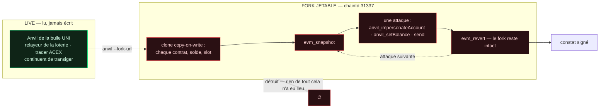
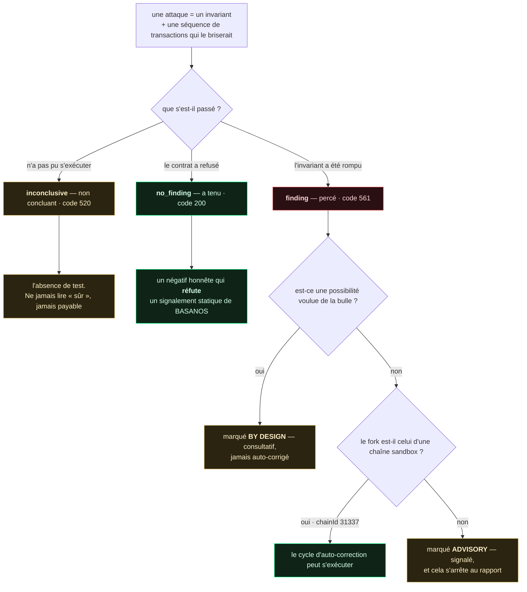
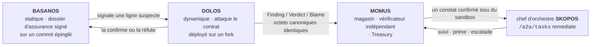
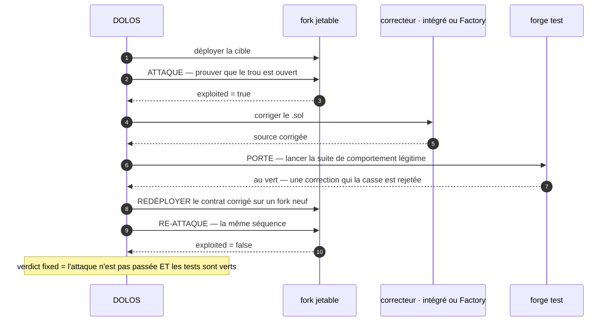

<p align="center"></p>

<h1 align="center">DOLOS — le fabricant d'exploits</h1>

<p align="center">
  <strong>DOLOS</strong> (Δόλος) — l'esprit grec de la ruse et de la tromperie.<br>
  Un banc d'attaque EVM dynamique pour la bulle UNI : il attaque les contrats déployés, prouve
  quels défauts sont réels — et, sur la chaîne sandbox uniquement, mène la correction jusqu'à un
  redéploiement re-testé.
</p>

<!-- aicom-readme-badges -->
<p align="center">
  <a href="https://github.com/alexar76/dolos/actions/workflows/ci.yml"></a>
  <a href="https://dolos.modelmarket.dev/"></a>
  <a href="https://alexar76.github.io/dolos/"></a>
  =3.11" />
  
  
  
  
  <a href="https://github.com/alexar76/dolos/blob/main/LICENSE"></a>
</p>
<!-- /aicom-readme-badges -->

<p align="center">
  🌐 <a href="README.md">English</a> ·
  <a href="README.ru.md">Русский</a> ·
  <a href="README.es.md">Español</a> ·
  <strong>Français</strong> ·
  <a href="README.zh.md">中文</a>
</p>

**Capability :** `agent.security.contract-redteam@v1` · **S'exécute contre :** l'Anvil de la bulle
UNI (`chainId 31337`) · **Couches sœurs :** [BASANOS](../basanos) (assurance statique) ·
[MOMUS](../momus) (équipe rouge pour HTTP/fédération)

---

## Sommaire

- [Pourquoi tout attaquer est sûr](#pourquoi-tout-attaquer-est-sûr)
- [Ce qu'est une attaque](#ce-quest-une-attaque)
- [Les trois issues](#les-trois-issues)
- [Des constats qui s'intègrent au pipeline](#des-constats-qui-sintègrent-au-pipeline)
- [Le cycle complet d'auto-correction](#le-cycle-complet-dauto-correction)
- [La limite de sécurité — et pourquoi UNI](#la-limite-de-sécurité--et-pourquoi-uni)
- [Utilisation](#utilisation)
- [Analyse périodique, et une mémoire](#analyse-périodique-et-une-mémoire)
- [Configuration](#configuration)
- [Tests](#tests)
- [Un LLM optionnel](#un-llm-optionnel--et-ce-à-quoi-il-na-pas-le-droit-de-toucher)
- [Renseignement externe](#renseignement-externe--lu-depuis-basanos-jamais-récupéré-ici)
- [Prérequis](#prérequis)
- [Avertissement](#avertissement)

---

## Pourquoi tout attaquer est sûr

La façon évidente de tester un contrat est de lancer un exploit sur la chaîne en production et de
revenir en arrière avec `evm_revert`. Dans la bulle UNI, c'est une erreur : son Anvil est
**partagé** — le relayeur de la loterie et le trader ACEX y transigent en continu, et un revert
effacerait silencieusement leur activité réelle.

DOLOS ne touche donc jamais la chaîne en production. Il lance son **propre**
`anvil --fork-url <live>` : un clone copy-on-write de l'état en production. Chaque contrat déployé,
chaque solde et chaque slot de stockage est là pour être attaqué — approvisionné en faux éther via
`anvil_setBalance`, pilotable **en tant que n'importe quelle adresse** via
`anvil_impersonateAccount` — et quand le fork est détruit, rien de ce qui s'y est passé n'a jamais
existé.



C'est la propriété sur laquelle repose toute la conception : **attaquer n'importe quoi, ne rien
risquer** — parce que la cible est un fork, pas la bulle, et jamais une chaîne réelle.

| Cheat code | Ce qu'il apporte | Pourquoi c'est sûr ici |
|---|---|---|
| `anvil --fork-url` | un clone copy-on-write de l'état en production | la cible est le clone ; la bulle n'est pas touchée |
| `evm_snapshot` / `evm_revert` | un retour arrière total et gratuit entre les attaques | le jetable, c'est le fork, pas la bulle |
| `anvil_impersonateAccount` | transiger **en tant que** propriétaire ou victime, sans clé | impossible sur une vraie chaîne — c'est tout l'intérêt |
| `anvil_setBalance` | approvisionner n'importe quelle adresse en faux éther pour le gaz | rien n'est réel ; rien ne survit au fork |

## Ce qu'est une attaque

Pas « appeler une fonction et voir ce qui se passe », mais un **invariant** que le contrat affirme,
et une séquence de transactions concrète qui le briserait :

| Attaque | Invariant | Sur les contrats UNI réels |
|---|---|---|
| `unauthorized_token_mint` | l'offre ne croît que par un minteur autorisé | **a tenu** — FakeUSDT ne mint que dans son constructeur |
| `escrow_channel_hijack` | l'id d'un canal ouvert ne peut être rouvert par un autre appelant | **a tenu** — la garde `depositor != 0` le refuse |
| `lottery_operator_bypass` | seul `OPERATOR_ROLE` peut ouvrir un tour / retirer les frais | **a tenu** — `onlyRole` est appliqué |

Chaque attaque lit son propre ABI dans la sortie de compilation de Foundry : tout appel qu'elle fait
est donc un appel que le contrat déployé expose réellement. Un ABI manquant rend l'attaque **non
concluante** — jamais une interface inventée, et jamais un succès présumé.

## Les trois issues



Le négatif honnête est la raison pour laquelle DOLOS existe à côté de BASANOS. BASANOS (statique)
signale *« n'importe quel appelant peut écrire `channels[<caller id>]` »* ; seule une véritable
tentative de détournement, annulée par le contrat, prouve si ce signalement est un vrai trou ou un
faux positif. Sur les contrats UNI en production, DOLOS a **réfuté** exactement ce signalement : il a
tenté le détournement, la garde a tenu, et il l'a dit.

## Des constats qui s'intègrent au pipeline

Un constat DOLOS est le même document signé qu'émet une sonde [MOMUS](../momus) : la triade au format
AWR **Finding / Verdict / Blame**, signée en Ed25519 sur une forme JSON canonique, compacte et
triée. Il s'intègre directement au magasin MOMUS, à son vérificateur et à la Treasury parce que les
octets canoniques sont identiques.



La clé de déduplication est dérivée uniquement de `target + probe + category + status_code` —
délibérément **pas** de la réponse — de sorte que le même bug n'est jamais payé deux fois, quel que
soit le nombre de re-scans.

La signature suit la séparation des tâches de l'écosystème : la clé du **scanner** signe le constat,
une clé de vérificateur **différente** signe le verdict, et aucune des deux n'est la clé de la
Treasury qui libère une prime. Là où `oracle-core` est installé, DOLOS signe avec le signataire
Ed25519 canonique de l'écosystème ; sinon, un signataire local reposant sur `cryptography` produit
les mêmes octets.

## Le cycle complet d'auto-correction

Le tout sur un fork sandbox jetable — **sans redéploiement d'infrastructure** : seul le contrat est
redéployé, sur un fork que l'on jette :



Prouvé de bout en bout sur le **DolosCanary** — un coffre construit pour être cassé (comme le canari
de MOMUS et PRAXIS) : un inconnu siphonne 5 ETH qu'il n'a jamais déposés ; le réparateur insère une
garde de solde ; `forge test` reste au vert (une correction qui casse les retraits légitimes est
rejetée) ; le contrat redéployé refuse le même siphonnage ; verdict `fixed`. Les vrais contrats UNI
ont tenu : il n'y a donc rien à y corriger — et c'est le bon résultat, pas une lacune.

Le réparateur est enfichable : le **correcteur intégré** applique des gardes déterministes, ou
définissez `DOLOS_FACTORY_FIX_URL` pour que la **Factory** produise le correctif. Une Factory
injoignable, muette ou qui renvoie sa propre entrée ne bloque jamais le cycle — le correcteur
intégré prend le relais. Un constat confirmé peut être transmis au skill `/a2a/tasks` du chef
d'orchestre de remédiation SKOPOS, la même entrée qu'utilise déjà la boucle d'auto-réparation
MOMUS→SKOPOS→Factory.

## La limite de sécurité — et pourquoi UNI

L'auto-correction-avec-redéploiement n'est autorisée que sur un fork d'une chaîne sandbox (`chainId`
dans `DOLOS_SANDBOX_CHAIN_IDS`, `31337` par défaut). Sur un contrat mainnet réel et immuable, rien
n'est jamais modifié automatiquement : le constat identique y est signalé **à titre consultatif
uniquement**, marqué comme tel dans le document, et cela s'arrête au rapport.

C'est toute la raison pour laquelle le banc vit dans UNI : la chaîne est jetable, donc la boucle de
correction est gratuite et réversible. Sur Base mainnet, le même code serait un bug critique et une
alerte, jamais un déploiement.

## Utilisation

```bash
# scan : forker l'anvil UNI en production, dérouler le catalogue, afficher les constats signés
python -m dolos scan --fork-url http://127.0.0.1:8545 --key data/dolos_scanner_key

# uniquement les exploits, en écartant les négatifs honnêtes
python -m dolos scan --only-exploits

# canary : le cycle complet attaque→correction→re-test→redéploiement→re-attaque sur un anvil jetable
python -m dolos canary --standalone

# canary via le correcteur de la Factory plutôt que l'intégré
DOLOS_FACTORY_FIX_URL=http://factory/api/remediation/solidity python -m dolos canary --standalone

# corriger un constat confirmé ; le verdict est signé par une clé de vérificateur INDÉPENDANTE
python -m dolos fix --finding out/finding.json --verifier-key data/dolos_verifier_key
```

Codes de sortie :

| Commande | `0` | `1` | `2` |
|---|---|---|---|
| `scan` | les contrats ont tenu | un exploit **non voulu** a été trouvé | n'a pas pu s'exécuter — pas de fork, pas de verdict |
| `canary` / `fix` | le trou a été refermé | il ne l'a pas été | — |

`2` est délibérément distinct de `0` : « nous n'avons jamais atteint la chaîne » ne doit jamais se
lire « tout va bien ».

## Analyse périodique, et une mémoire

Rien dans l'arbre ne planifiait auparavant une analyse de contrats — ni minuteur, ni cron, ni
intervalle — le nœud du moniteur affichait donc ce que la dernière exécution manuelle avait laissé.
Ni BASANOS ni MOMUS n'avaient de planificateur non plus ; celui-ci est le premier.

```bash
# recommandé : un minuteur systemd exécute UN cycle puis sort — un fork fuité coûte un cycle, pas le veilleur
sudo dolos/deploy/install-timer.sh --interval hourly

# ou une boucle longue durée, pour un portable ou un conteneur sans minuteur
python -m dolos watch --interval 3600 --memos data/attack_memos.jsonl
```

`--memos PATH` donne à DOLOS une mémoire de ses propres résultats. Elle ne peut que **réordonner le
catalogue**, afin qu'un cycle dépense son budget là où le rendement a réellement été. Elle ne peut
pas ajouter une attaque, en retirer une, ni changer un verdict — chaque attaque s'exécute toujours à
chaque cycle, et l'histoire n'a aucune voix sur ce que le fork a fait. Ordonner n'est pas filtrer :
une attaque qui cesserait de s'exécuter deviendrait silencieusement un invariant non testé, rapporté
comme s'il avait été vérifié.

Le piège qu'elle encode : le mint ouvert du stable UNI donne `exploited=True` à **chaque** exécution
parce que c'est le robinet voulu de la bulle ; classer sur le nombre brut d'exploits le figerait donc
en tête pour toujours et repousserait les attaques susceptibles de trouver quelque chose de réel. Le
rendement ne compte **que** les constats non marqués by-design.

| Variable | Défaut | Rôle |
|---|---|---|
| `DOLOS_WATCH_INTERVAL_S` | `3600` | Secondes entre les cycles (plancher `30`). |
| `DOLOS_MEMO_PATH` | *(non défini)* | Le journal de mémoire. Non défini = pas de mémoire, comportement identique à l'ancien. |

`watch` émet une ligne JSON par cycle sur stdout (pour que `dolos watch | jq` fonctionne) et son
résumé final sur stderr. Il sort avec `1` si aucun cycle n'a jamais terminé une analyse : une chaîne
définitivement injoignable ne doit pas sortir avec `0` et se lire comme un veilleur en bonne santé.

## Configuration

| Variable | Défaut | Rôle |
|---|---|---|
| `DOLOS_FORK_URL` | `http://127.0.0.1:8545` | RPC de la chaîne **en production** à forker |
| `DOLOS_REALM` | `uni` | le realm dont on lit le carnet d'adresses |
| `DOLOS_ADDRESS_BOOK` | — | chemin explicite vers `universe_config.json` |
| `DOLOS_SANDBOX_CHAIN_IDS` | `31337` | chain ids contre lesquels une boucle de correction peut tourner |
| `DOLOS_SIGNING_KEY_PATH` | — | clé Ed25519 du scanner ; sans elle les constats ne sont pas signés |
| `DOLOS_VERIFIER_KEY_PATH` | — | clé de vérificateur **indépendante** pour les verdicts de correction |
| `DOLOS_FACTORY_FIX_URL` | — | endpoint de remédiation de la Factory pour les correctifs |
| `DOLOS_CONDUCTOR_URL` | — | chef d'orchestre SKOPOS ; sans lui rien n'est soumis |
| `DOLOS_CONDUCTOR_PEER_TOKEN` | — | jeton A2A (repli : `SKOPOS_A2A_TOKEN`) |
| `DOLOS_LAST_SCAN_PATH` | `/app/data/universe/dolos_last_scan.json` | artefact que lit le nœud Alien Monitor |
| `DOLOS_ANVIL_BIN` / `DOLOS_FORGE_BIN` | depuis `PATH` | binaires Foundry |

## Tests

```bash
pip install -e '.[dev,signing]'
pytest                     # configuration et seuil de couverture depuis pyproject.toml
```

**233 tests · 96 % de couverture de branches** avec Foundry installé ; **92 %** sans lui, car les
tests d'intégration de `tests/test_smoke.py` s'auto-ignorent là où `anvil`/`forge` sont absents et
emportent avec eux la mécanique de processus de `ForkChain`. Le seuil (`--cov-fail-under=90`) passe
dans les deux configurations : un portable n'ayant que les dépendances pures exécute donc quand même
une suite qui a du sens.

La suite unitaire ne simule que deux choses — les cheat codes du fork et l'objet contrat de web3 —
de sorte que chaque *décision* est testée sans chaîne : quel invariant a été rompu, ce que dit le
constat, ce qui peut être auto-corrigé. Cela couvre les chemins qu'une exécution de bout en bout au
vert ne montre jamais :

- une attaque qui plante en plein catalogue est **non concluante** et n'arrête pas le scan ;
- une correction qui met `forge test` au rouge est **rejetée**, pas livrée ;
- un canari qui refuse d'être percé **interrompt** le cycle au lieu de revendiquer une correction ;
- un nœud qui répond par une erreur, un 500 ou rien du tout lève `ForkError` — « n'a pas pu
  s'exécuter », jamais « le contrat est sûr » ;
- une Factory injoignable, un chef d'orchestre injoignable et une réponse corrompue sont signalés,
  jamais avalés en faux succès.

## Renseignement externe — lu depuis BASANOS, jamais récupéré ici

La [mémoire d'attaques](#analyse-périodique-et-une-mémoire) est *endogène* : elle apprend lesquelles
des attaques de DOLOS ont payé. Elle ne dit rien d'une classe de faiblesse que le monde vient de
découvrir. Le renseignement est l'autre moitié — et délibérément **pas** un second flux.

```bash
export DOLOS_INTEL_URL=http://basanos:9470
python -m dolos intel        # ce que sait BASANOS, et ce pour quoi DOLOS n'a aucune attaque
python -m dolos scan         # ce même renseignement réordonne cette analyse
```

BASANOS ingère déjà OSV (`@openzeppelin/contracts`, `solmate`) et GHSA derrière une liste blanche
d'hôtes, et distille chaque avis sur son ensemble fermé de catégories. Un second récupérateur ici
signifierait une seconde liste blanche à maintenir juste, de secondes limites de débit et un second
endroit où mal traiter un avis — pour des données que BASANOS a déjà validées. Cela trace aussi la
frontière entre couches dans le bon sens : **BASANOS lit le source et signale une classe ; DOLOS
attaque ce qui est déployé et découvre si la classe est réellement atteignable.** Un avis visant une
bibliothèque qu'importent nos contrats est exactement la question à laquelle BASANOS ne peut répondre.

### La voie d'injection n'existe pas

Un avis est du texte non fiable écrit par des inconnus. La conception évidente — classer les attaques
en lisant titres et résumés — mettrait de la prose contrôlée par un attaquant sur le chemin qui
décide de ce que fait DOLOS. Cette surface n'est pas gardée ici : elle est **absente** :

> L'ordonnancement ne lit **que** `category_scores` — des nombres indexés par un enum fermé de 11
> valeurs — et jamais un titre, un résumé, une url ou un identifiant.

Le texte des fiches n'est transporté que pour l'affichage et pour `propose`, et il est assaini en
sortie. `tests/test_intel.py` le fige avec deux instantanés identiques en chiffres et radicalement
différents en texte (l'un portant `IGNORE PREVIOUS INSTRUCTIONS…`) : ils doivent s'ordonner à
l'identique, et le test échoue dès que quelqu'un « améliore » le classement en regardant le texte.

### Ce qu'une fiche peut faire — et ce qu'elle signale à la place

Une fiche peut relever la priorité d'une attaque existante, d'un montant **borné** (`MAX_BOOST`, un
plafond et non une somme, pour qu'un déluge d'avis dans une catégorie ne l'emporte pas sur ce que
DOLOS a réellement *mesuré* de ses attaques). Elle ne peut pas ajouter une attaque, en retirer une,
changer un verdict, ni déloger de la première place une attaque jamais exécutée.

L'information vraiment neuve, c'est le **manque** : une classe chaude sans attaque au catalogue.

```
reentrancy      0.61   -> no attack in the catalog covers this class
delegatecall    0.44   -> no DOLOS attack category maps to this class
```

C'est précisément l'entrée que [`dolos propose`](#un-llm-optionnel--et-ce-à-quoi-il-na-pas-le-droit-de-toucher)
existe pour transformer en candidat relu. Les manques sont signalés, jamais comblés automatiquement :
le catalogue reste fermé, et c'est toujours un humain qui écrit l'attaque.

| Variable | Défaut | Rôle |
|---|---|---|
| `DOLOS_INTEL_URL` | *(non défini)* | URL de base de BASANOS. Non défini = pas de renseignement ; DOLOS fonctionne même sans BASANOS. |

Un BASANOS injoignable produit un instantané vide et laisse l'ordre exactement tel que la mémoire
l'a laissé — le renseignement ne s'applique jamais à moitié.

## Un LLM optionnel — et ce à quoi il n'a pas le droit de toucher

Les verdicts de DOLOS viennent de ce que le fork a réellement fait : un revert, un solde siphonné,
le statut d'un reçu. Un modèle ne peut pas rendre un revert plus ou moins vrai, donc **un modèle n'a
aucune voix sur un verdict** et aucun moyen d'agrandir le catalogue. Il a exactement deux rôles
consultatifs :

```bash
# 1. EXPLAIN — de la prose pour un constat qui a DÉJÀ un verdict (le verdict est une entrée, jamais une sortie)
python -m dolos explain --finding out/finding.json

# 2. PROPOSE — des attaques candidates depuis le code d'un contrat, vers une file inerte de revue
python -m dolos propose --source contracts/evm/src/AIMarketEscrow.sol
```

**Les propositions sont inertes.** Ce sont des notes pour un humain : non enregistrées, non
exécutées, non comptées. En transformer une en attaque signifie que quelqu'un écrit le code, lit la
séquence et la commite — le catalogue reste fermé, pour la même raison que la
[mémoire d'attaques](#analyse-périodique-et-une-mémoire) ne peut que le réordonner. Un scanner qui
fait croître sa propre surface d'attaque à partir de ses propres suggestions est un scanner que
personne ne peut auditer, et son premier `exploited=true` serait indiscernable d'un vrai.

**La limite est structurelle, pas une promesse.** `attacks.py`, `harness.py`, `forkchain.py`,
`findings.py`, `fixloop.py`, `memos.py` et `submit.py` ne peuvent pas importer `llm.py`, et
`tests/test_llm.py` échoue si cela change. Un module qui ne peut pas importer un modèle ne peut pas
être influencé par un modèle. C'est aussi pourquoi `explain` est une commande de l'opérateur et non
quelque chose que l'analyse appelle : le cycle périodique doit continuer à fonctionner quand le
réseau ne fonctionne pas.

| Variable | Défaut | Rôle |
|---|---|---|
| `DOLOS_LLM_PROVIDER` | `offline` | `offline` · `openrouter` · `deepseek` · `anthropic` · `openai` · `ollama` · `lmstudio` |
| `DOLOS_LLM_MODEL` | selon le fournisseur | Remplace le modèle du preset. |
| `DOLOS_LLM_API_KEY` | — | Se rabat sur `OPENROUTER_API_KEY` / `DEEPSEEK_API_KEY` / `ANTHROPIC_API_KEY`, puis `DOLOS_LLM_API_KEY_FILE`. |
| `DOLOS_PROPOSAL_QUEUE` | `data/attack_proposals.jsonl` | La file inerte. |
| `DOLOS_LLM_MAX_TOKENS` | `6000` | Budget de sortie. **Les modèles de raisonnement le dépensent avant d'émettre** : à 1200, `minimax/minimax-m3` et `deepseek-v4-pro` renvoyaient HTTP 200 avec un contenu vide et dégradaient en silence. La dégradation nomme désormais la raison (`truncated…` vs `HTTP 401`) au lieu de ressembler à une panne. |

Le réglage de production est **OpenRouter + `minimax/minimax-m3`** — la même base URL et le même id de
modèle que la factory exécute déjà (`llm/persist_openrouter.py`), pour que le satellite ne dérive pas
vers les siens :

```bash
export DOLOS_LLM_PROVIDER=openrouter   # OPENROUTER_API_KEY est repris automatiquement
```

Le défaut reste `offline` : déterministe, sans socket, sans clé, de sorte que toute la suite tourne
sans aucun modèle joignable. Un fournisseur inconnu, un endpoint mort ou une réponse illisible
dégradent vers cette voie plutôt que de faire échouer la commande : cette couche est consultative, et
le consultatif ne doit jamais devenir porteur. Aucune dépendance nouvelle : elle parle HTTP via
`urllib`, comme le fait déjà `submit.py`.

## Prérequis

Foundry (`anvil`, `forge`) et `web3` ; `oracle-core` pour le signataire Ed25519 canonique (un
signataire local reposant sur `cryptography` est utilisé en son absence). Sans backend de signature,
les constats restent non signés — toujours lisibles, simplement non payables par le pipeline.

## Avertissement

DOLOS est un **outil d'équipe rouge pour la recherche en sécurité**, destiné à tester **vos propres**
contrats intelligents sur un **fork sandbox jetable** que vous contrôlez. Il n'est pas destiné à une
utilisation contre des systèmes que vous ne possédez pas ou n'êtes pas autorisé à tester ; le faire
peut être illégal. Ses capacités offensives (usurpation d'adresse, mint, siphonnage, transactions
d'exploit) ne sont sûres ici que parce que la cible est un fork jetable d'un Anvil local, jamais une
chaîne réelle. Les constats issus d'un fork d'une chaîne non-sandbox sont **à titre consultatif
uniquement** et ne sont jamais corrigés automatiquement. Fourni **tel quel, sans garantie d'aucune
sorte** (MIT) ; l'opérateur est responsable de l'usage qui en est fait.

MIT. Fait partie de l'écosystème AIMarket ; ne s'exécute que contre le sandbox UNI, jamais contre
une chaîne de production.
