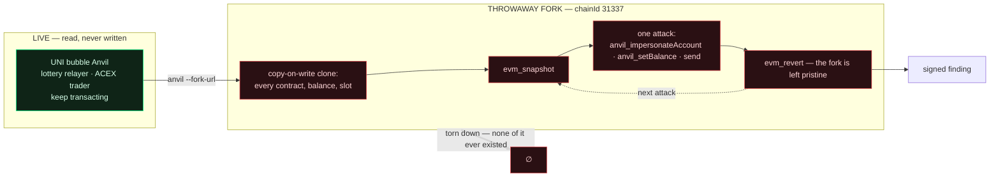
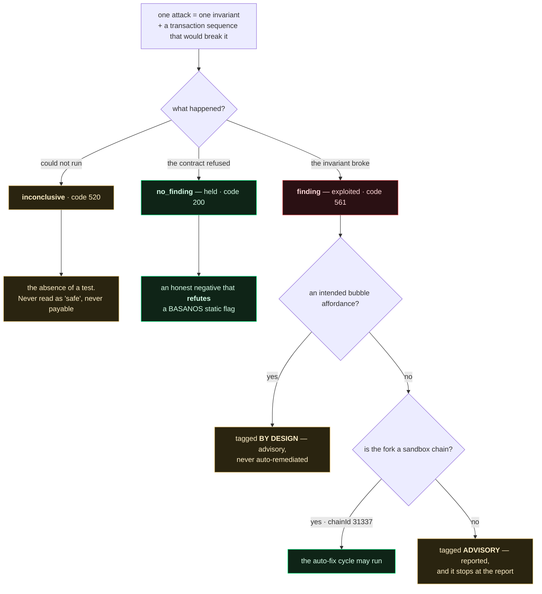
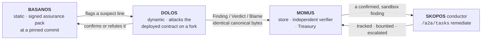
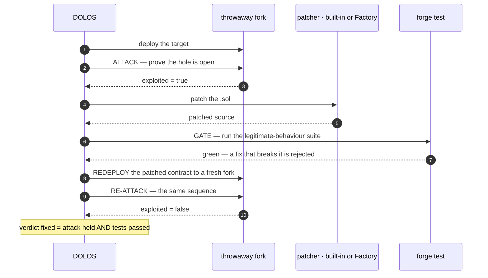

<!-- aicom-mirror-notice -->
> **📖 Read-only mirror.** `dolos` is published from the canonical AI-Factory monorepo.
> **Pull requests are not accepted** — any commit pushed here is overwritten by
> `scripts/mirror_satellites.sh` on the next sync.
> 🐞 Found a bug or have a request? Please **[open an issue](https://github.com/alexar76/dolos/issues)**.

<p align="center"></p>

<h1 align="center">DOLOS — the exploit crafter</h1>

<p align="center">
  <strong>DOLOS</strong> (Δόλος) — the Greek spirit of trickery and guile.<br>
  A dynamic EVM attack harness for the UNI bubble: it attacks the deployed contracts, proves which
  flaws are real — and, on the sandbox chain only, drives a fix through to a re-tested redeploy.
</p>

<!-- aicom-readme-badges -->
<p align="center">
  <a href="https://github.com/alexar76/dolos/actions/workflows/ci.yml"></a>
  <a href="https://dolos.modelmarket.dev/"></a>
  <a href="https://alexar76.github.io/dolos/"></a>
  =3.11" />
  
  
  
  
  <a href="https://github.com/alexar76/dolos/blob/main/LICENSE"></a>
</p>
<!-- /aicom-readme-badges -->

<p align="center">
  🌐 <strong>English</strong> ·
  <a href="README.ru.md">Русский</a> ·
  <a href="README.es.md">Español</a> ·
  <a href="README.fr.md">Français</a> ·
  <a href="README.zh.md">中文</a>
</p>

**Capability:** `agent.security.contract-redteam@v1` · **Runs against:** the UNI bubble's Anvil
(`chainId 31337`) · **Sibling layers:** [BASANOS](../basanos) (static assurance) ·
[MOMUS](../momus) (red team for HTTP/federation)

---

## Contents

- [Why it is safe to attack everything](#why-it-is-safe-to-attack-everything)
- [What an attack is](#what-an-attack-is)
- [The three outcomes](#the-three-outcomes)
- [Findings that plug into the pipeline](#findings-that-plug-into-the-pipeline)
- [The full auto-fix cycle](#the-full-auto-fix-cycle)
- [The safety boundary — and why UNI](#the-safety-boundary--and-why-uni)
- [Usage](#usage)
- [Periodic scanning, and a memory](#periodic-scanning-and-a-memory)
- [Configuration](#configuration)
- [Tests](#tests)
- [An optional LLM](#an-optional-llm--and-what-it-is-not-allowed-to-touch)
- [External intel](#external-intel--read-from-basanos-never-fetched-here)
- [Requirements](#requirements)
- [Disclaimer](#disclaimer)

---

## Why it is safe to attack everything

The obvious way to test a contract is to throw an exploit at the live chain and roll back with
`evm_revert`. On the UNI bubble that is wrong: its Anvil is **shared** — the lottery relayer and the
ACEX trader transact on it continuously, and a revert would silently discard their real activity.

So DOLOS never touches the live chain. It spawns its **own** `anvil --fork-url <live>`: a
copy-on-write clone of the live state. Every deployed contract, balance and storage slot is there
to attack — funded with fake ether via `anvil_setBalance`, drivable **as any address** via
`anvil_impersonateAccount` — and when the fork is torn down, nothing that happened on it ever
existed.



That is the property the whole design rests on: **attack anything, risk nothing** — because the
target is a fork, not the bubble, and never a real chain.

| Cheat code | What it buys | Why it is safe here |
|---|---|---|
| `anvil --fork-url` | a copy-on-write clone of live state | the clone is the target; the bubble is untouched |
| `evm_snapshot` / `evm_revert` | free, total rollback between attacks | the disposable thing is the fork, not the bubble |
| `anvil_impersonateAccount` | transact **as** the owner or the victim, with no key | impossible on a real chain — that is the point |
| `anvil_setBalance` | fund any address with fake ether for gas | none of it is real; none of it outlives the fork |

## What an attack is

Not "call a function and see what happens" — an **invariant** the contract claims, and a concrete
transaction sequence that would break it:

| Attack | Invariant | On the real UNI contracts |
|---|---|---|
| `unauthorized_token_mint` | supply grows only through an authorized minter | **held** — FakeUSDT mints only in its constructor |
| `escrow_channel_hijack` | an open channel id cannot be reopened by another caller | **held** — the `depositor != 0` guard refuses it |
| `lottery_operator_bypass` | only `OPERATOR_ROLE` may open a round / withdraw fees | **held** — `onlyRole` enforced |

Each attack reads its own ABI out of the Foundry build output, so every call it makes is a call the
deployed contract actually exposes. A missing ABI makes the attack **inconclusive** — never a made-up
interface, and never an assumed pass.

## The three outcomes



The honest negative is why DOLOS exists next to BASANOS. BASANOS (static) flags *"any caller can
write `channels[<caller id>]`"*; only actually trying the hijack and being reverted proves whether
that flag is a real hole or a false positive. On the live UNI contracts DOLOS **refuted** exactly
that flag — it tried the hijack, the guard held, and it said so.

## Findings that plug into the pipeline

A DOLOS finding is the same signed document a [MOMUS](../momus) probe emits — the AWR-shaped triad
**Finding / Verdict / Blame**, Ed25519-signed over a canonical, compact, sorted JSON form. It drops
straight into the MOMUS store, verifier and Treasury because the canonical bytes are identical.



The dedup key is derived from `target + probe + category + status_code` only — deliberately **not**
from the response — so the same bug is never payable twice, however often it is rescanned.

Signing follows the ecosystem's split of duties: the **scanner** key signs the finding, a
**different** verifier key signs the verdict, and neither is the treasury key that releases a
payout. Where `oracle-core` is installed DOLOS signs with the ecosystem's canonical Ed25519 signer;
where it is not, a `cryptography`-backed local signer produces the identical bytes.

## The full auto-fix cycle

All on a throwaway sandbox fork — **no infrastructure redeploy**, only the single contract is
redeployed, onto a fork that is thrown away:



Proven end to end on the **DolosCanary** — a vault built to be broken (like the MOMUS canary and
PRAXIS): a stranger drains 5 ETH it never deposited; the fixer inserts a balance guard; `forge test`
stays green (a fix that breaks legitimate withdrawals is rejected); the redeployed contract refuses
the same drain; verdict `fixed`. Real UNI contracts held, so there is nothing to fix on them — and
that is the correct outcome, not a gap.

The fixer is pluggable: the **built-in patcher** applies deterministic guards, or set
`DOLOS_FACTORY_FIX_URL` to let the **Factory** produce the patch. A Factory that is down, silent or
echoes its input never blocks the loop — the built-in patcher takes over. A confirmed finding can be
handed to the SKOPOS remediation conductor's `/a2a/tasks` skill, the same entry the
MOMUS→SKOPOS→Factory self-healing loop already uses.

## The safety boundary — and why UNI

Auto-fix-and-redeploy is allowed **only** on a fork of a sandbox chain (`chainId` in
`DOLOS_SANDBOX_CHAIN_IDS`, default `31337`). On a real, immutable mainnet contract nothing is ever
changed automatically: the identical finding there is reported as **advisory** and stops at the
report, tagged as such in the document.

This is the whole reason the harness lives in UNI — the chain is disposable, so the fix loop is free
and reversible. On Base mainnet the same code would be a critical bug and an alert, never a deploy.

## Usage

```bash
# scan: fork the live UNI anvil, run the catalog, print signed findings
python -m dolos scan --fork-url http://127.0.0.1:8545 --key data/dolos_scanner_key

# only the exploits, dropping the honest negatives
python -m dolos scan --only-exploits

# canary: the full attack→fix→retest→redeploy→re-attack cycle on a throwaway anvil
python -m dolos canary --standalone

# canary via the Factory patcher instead of the built-in one
DOLOS_FACTORY_FIX_URL=http://factory/api/remediation/solidity python -m dolos canary --standalone

# fix one confirmed finding, verdict signed by an INDEPENDENT verifier key
python -m dolos fix --finding out/finding.json --verifier-key data/dolos_verifier_key
```

Exit codes:

| Command | `0` | `1` | `2` |
|---|---|---|---|
| `scan` | the contracts held | a **non-by-design** exploit was found | could not run — no fork, no verdict |
| `canary` / `fix` | the hole was closed | it was not | — |

`2` is deliberately distinct from `0`: "we never reached the chain" must never read as "all clear".

## Periodic scanning, and a memory

Nothing in the tree used to schedule a contract scan — no timer, no cron, no interval — so the
monitor node showed whatever the last hand-run had left behind. Neither BASANOS nor MOMUS had a
scheduler either; this is the first one.

```bash
# recommended: a systemd timer runs ONE cycle and exits — a leaked fork costs a cycle, not the watcher
sudo dolos/deploy/install-timer.sh --interval hourly

# or a long-lived loop, for a laptop or a container without a timer
python -m dolos watch --interval 3600 --memos data/attack_memos.jsonl
```

`--memos PATH` gives DOLOS a memory of its own outcomes. It may **only reorder the catalog**, so a
cycle spends its budget where the yield has actually been. It may not add an attack, drop one, or
change a verdict — every attack still runs every cycle, and history gets no vote on what the fork
did. Ordering is not filtering: an attack that stopped running would silently become an untested
invariant, reported as though it had been checked.

The trap it encodes: the UNI stablecoin's open mint is `exploited=True` on **every** run because it
is the bubble's intended faucet, so ranking on raw exploit count would pin it first for ever and
push the attacks that might find something real to the back. Yield counts **non-by-design**
findings only.

| Variable | Default | What it does |
|---|---|---|
| `DOLOS_WATCH_INTERVAL_S` | `3600` | Seconds between cycles (floor `30`). |
| `DOLOS_MEMO_PATH` | *(unset)* | The memory journal. Unset = no memory, byte-identical old behaviour. |

`watch` streams one JSON line per cycle on stdout (so `dolos watch | jq` works) and its closing
summary on stderr. It exits `1` if not one cycle ever completed a scan — a permanently unreachable
chain must not exit `0` and read as a healthy watcher.

## Configuration

| Variable | Default | What it does |
|---|---|---|
| `DOLOS_FORK_URL` | `http://127.0.0.1:8545` | RPC of the **live** chain to fork |
| `DOLOS_REALM` | `uni` | which realm's address book to read |
| `DOLOS_ADDRESS_BOOK` | — | explicit path to `universe_config.json` |
| `DOLOS_SANDBOX_CHAIN_IDS` | `31337` | chain ids a fix loop may run against |
| `DOLOS_SIGNING_KEY_PATH` | — | scanner Ed25519 key; findings are unsigned without it |
| `DOLOS_VERIFIER_KEY_PATH` | — | **independent** verifier key for fix verdicts |
| `DOLOS_FACTORY_FIX_URL` | — | Factory remediation endpoint for patches |
| `DOLOS_CONDUCTOR_URL` | — | SKOPOS conductor; nothing is submitted without it |
| `DOLOS_CONDUCTOR_PEER_TOKEN` | — | A2A token (falls back to `SKOPOS_A2A_TOKEN`) |
| `DOLOS_LAST_SCAN_PATH` | `/app/data/universe/dolos_last_scan.json` | artifact the Alien Monitor node reads |
| `DOLOS_ANVIL_BIN` / `DOLOS_FORGE_BIN` | from `PATH` | Foundry binaries |

## Tests

```bash
pip install -e '.[dev,signing]'
pytest                     # config, coverage gate and all, from pyproject.toml
```

**233 tests · 96% branch coverage** with Foundry installed; **92%** without it, because the
integration tests in `tests/test_smoke.py` self-skip where `anvil`/`forge` are absent and take
`ForkChain`'s process plumbing with them. The gate (`--cov-fail-under=90`) passes in both
configurations, so a laptop with only the pure dependencies still runs a meaningful suite.

The unit suite fakes exactly two things — the fork's cheat codes and web3's contract handle — so
every *decision* is tested without a chain: which invariant broke, what the finding says, what may
be auto-fixed. What that buys is the paths a green end-to-end run never shows:

- an attack that crashes mid-catalog is **inconclusive**, and does not stop the scan;
- a fix that turns `forge test` red is **rejected**, not shipped;
- a canary that refuses to be exploited **aborts** rather than claiming a fix;
- a node that answers with an error, a 500, or nothing at all raises `ForkError` — "could not run",
  never "the contract is safe";
- an unreachable Factory, an unreachable conductor and a garbled reply are all reported, never
  swallowed into a false success.

## External intel — read from BASANOS, never fetched here

The [attack memory](#periodic-scanning-and-a-memory) is *endogenous*: it learns which of DOLOS's own
attacks have paid off. That says nothing about a weakness class the world just learned about. Intel
is the other half — and deliberately **not** a second feed.

```bash
export DOLOS_INTEL_URL=http://basanos:9470
python -m dolos intel        # what BASANOS knows, and what DOLOS has no attack for
python -m dolos scan         # the same intel reorders this scan
```

BASANOS already ingests OSV (`@openzeppelin/contracts`, `solmate`) and GHSA behind a host allowlist
and distills each advisory onto its closed detector-category set. A second fetcher here would mean a
second allowlist to keep correct, second rate limits, and a second place to mishandle an advisory —
for data BASANOS has already vetted. It also draws the layer boundary the right way round: **BASANOS
reads source and flags a class; DOLOS attacks what is deployed and finds out whether the class is
actually reachable.** An advisory against a library our contracts import is exactly the question
BASANOS cannot answer.

### The injection path does not exist

An advisory is untrusted text written by strangers. The obvious design — rank attacks by reading
card titles and summaries — would put attacker-controlled prose on the path that decides what DOLOS
does. That surface is not guarded here, it is **absent**:

> Ordering reads **only** `category_scores` — floats keyed by a closed 11-value enum — and never a
> title, summary, url or identifier.

Card text is carried for display and for `propose` only, and is sanitised on the way out.
`tests/test_intel.py` pins this with two snapshots that are identical in scores but whose card text
differs wildly (one carrying `IGNORE PREVIOUS INSTRUCTIONS…`): they must order identically, and the
test fails the moment someone "improves" the ranker by looking at text.

### What a card may do — and what it reports instead

A card may raise an existing attack's priority, by a **bounded** amount (`MAX_BOOST`, capped rather
than summed, so a flood of advisories in one category cannot outrank what DOLOS has actually
*measured* about its own attacks). It cannot add an attack, drop one, change a verdict, or demote a
never-run attack out of first place.

The genuinely new information is the **gap**: a hot class with no attack in the catalog.

```
reentrancy      0.61   -> no attack in the catalog covers this class
delegatecall    0.44   -> no DOLOS attack category maps to this class
```

That is precisely the input [`dolos propose`](#an-optional-llm--and-what-it-is-not-allowed-to-touch)
exists to turn into a reviewed candidate. Gaps are reported, never auto-filled — the catalog stays
closed, and a human still writes the attack.

| Variable | Default | What it does |
|---|---|---|
| `DOLOS_INTEL_URL` | *(unset)* | BASANOS base URL. Unset = no intel; DOLOS works with no BASANOS at all. |

An unreachable BASANOS yields an empty snapshot and leaves ordering exactly as memory left it —
intel never half-applies.

## An optional LLM — and what it is not allowed to touch

DOLOS's verdicts come from what a fork actually did: a revert, a drained balance, a receipt status.
A model cannot make a revert more or less true, so **a model gets no say in a verdict** and no
ability to grow the catalog. It gets exactly two advisory roles:

```bash
# 1. EXPLAIN — prose for a finding that ALREADY has a verdict (the verdict is input, never output)
python -m dolos explain --finding out/finding.json

# 2. PROPOSE — candidate attacks from a contract's source, into an inert review queue
python -m dolos propose --source contracts/evm/src/AIMarketEscrow.sol
```

**Proposals are inert.** They are notes to a human: not registered, not executed, not counted.
Turning one into an attack means somebody writes the code, reads the sequence and commits it — the
catalog stays closed, for the same reason the [attack memory](#periodic-scanning-and-a-memory) may
only reorder it. A scanner that grows its own attack surface from its own suggestions is a scanner
nobody can audit, and its first `exploited=true` would be indistinguishable from a real one.

**The boundary is structural, not a promise.** `attacks.py`, `harness.py`, `forkchain.py`,
`findings.py`, `fixloop.py`, `memos.py` and `submit.py` cannot import `llm.py`, and
`tests/test_llm.py` fails if that changes. A module that cannot import a model cannot be influenced
by one. It is also why `explain` is an operator-invoked command rather than something the scan
calls: the periodic cycle has to keep working when the network does not.

| Variable | Default | What it does |
|---|---|---|
| `DOLOS_LLM_PROVIDER` | `offline` | `offline` · `openrouter` · `deepseek` · `anthropic` · `openai` · `ollama` · `lmstudio` |
| `DOLOS_LLM_MODEL` | per provider | Override the preset model. |
| `DOLOS_LLM_API_KEY` | — | Falls back to `OPENROUTER_API_KEY` / `DEEPSEEK_API_KEY` / `ANTHROPIC_API_KEY`, then `DOLOS_LLM_API_KEY_FILE`. |
| `DOLOS_PROPOSAL_QUEUE` | `data/attack_proposals.jsonl` | The inert queue. |
| `DOLOS_LLM_MAX_TOKENS` | `6000` | Output budget. **Reasoning models spend it before emitting**: at 1200, `minimax/minimax-m3` and `deepseek-v4-pro` returned HTTP 200 with empty content and degraded silently. A degraded result now names the reason (`truncated…` vs `HTTP 401`) instead of looking like an outage. |

Production setting is **OpenRouter + `minimax/minimax-m3`** — the same base URL and model id the
factory already runs (`llm/persist_openrouter.py`), so the satellite does not drift onto its own:

```bash
export DOLOS_LLM_PROVIDER=openrouter   # OPENROUTER_API_KEY is picked up automatically
```

The default stays `offline`: deterministic, no socket, no key, so the whole suite runs with no model
reachable. An unknown provider, a dead endpoint or an unparseable reply all degrade to that path
rather than failing the command — this layer is advisory, and advisory must never become load-bearing.
No new dependency: it speaks HTTP over `urllib`, the same way `submit.py` already does.

## Requirements

Foundry (`anvil`, `forge`) and `web3`; `oracle-core` for the canonical Ed25519 signer (a
`cryptography`-backed local signer is used when it is absent). Findings are unsigned — still
readable, just not pipeline-payable — when no signer backend is available.

## Disclaimer

DOLOS is a **security-research red-team tool** for testing **your own** smart contracts on a
**disposable sandbox fork** you control. It is not for use against systems you do not own or are
not authorized to test; doing so may be illegal. Its offensive capabilities (impersonation, minting,
draining, exploit transactions) are safe here only because the target is a throwaway fork of a
local Anvil — never a real chain. Findings from a fork of a non-sandbox chain are **advisory only**
and are never auto-remediated. Provided **as is, without warranty of any kind** (MIT); the operator
is responsible for how it is used.

MIT. Part of the AIMarket ecosystem; runs only against the UNI sandbox, never a production chain.
