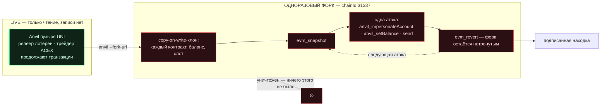
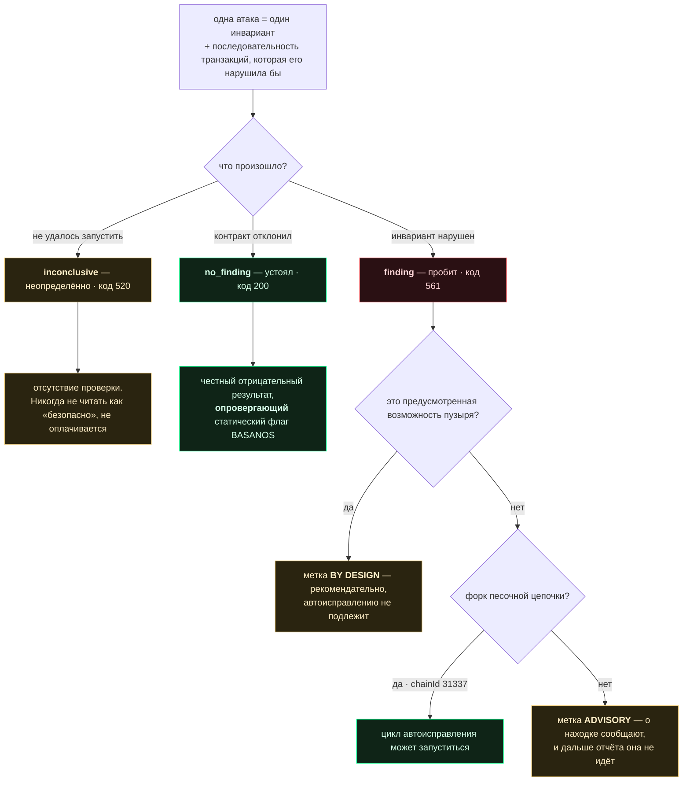
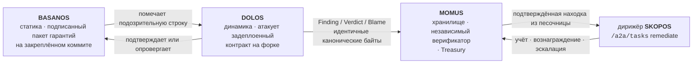
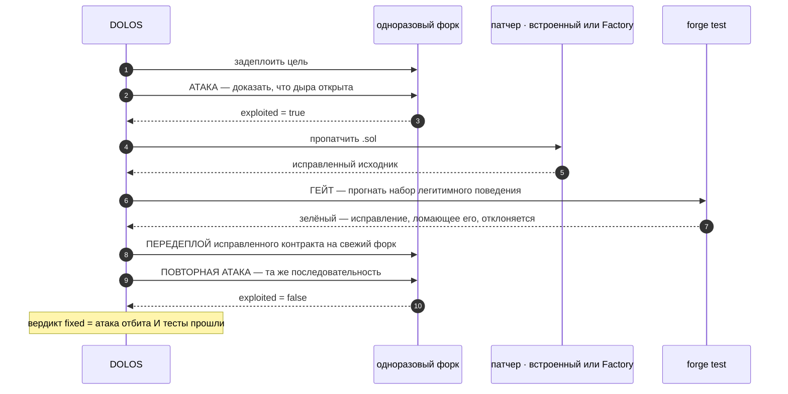

<p align="center"></p>

<h1 align="center">DOLOS — конструктор эксплойтов</h1>

<p align="center">
  <strong>DOLOS</strong> (Δόλος) — греческий дух обмана и коварства.<br>
  Динамический стенд атак на EVM для пузыря UNI: он атакует задеплоенные контракты, доказывает,
  какие изъяны реальны, — и только на песочной цепочке доводит исправление до повторно
  протестированного деплоя.
</p>

<!-- aicom-readme-badges -->
<p align="center">
  <a href="https://github.com/alexar76/dolos/actions/workflows/ci.yml"></a>
  <a href="https://dolos.modelmarket.dev/"></a>
  <a href="https://alexar76.github.io/dolos/"></a>
  =3.11" />
  
  
  
  
  <a href="https://github.com/alexar76/dolos/blob/main/LICENSE"></a>
</p>
<!-- /aicom-readme-badges -->

<p align="center">
  🌐 <a href="README.md">English</a> ·
  <strong>Русский</strong> ·
  <a href="README.es.md">Español</a> ·
  <a href="README.fr.md">Français</a> ·
  <a href="README.zh.md">中文</a>
</p>

**Capability:** `agent.security.contract-redteam@v1` · **Работает против:** Anvil пузыря UNI
(`chainId 31337`) · **Родственные слои:** [BASANOS](../basanos) (статические гарантии) ·
[MOMUS](../momus) (красная команда для HTTP/федерации)

---

## Содержание

- [Почему безопасно атаковать всё подряд](#почему-безопасно-атаковать-всё-подряд)
- [Что такое атака](#что-такое-атака)
- [Три исхода](#три-исхода)
- [Находки, встраивающиеся в пайплайн](#находки-встраивающиеся-в-пайплайн)
- [Полный цикл автоисправления](#полный-цикл-автоисправления)
- [Граница безопасности — и почему UNI](#граница-безопасности--и-почему-uni)
- [Использование](#использование)
- [Периодическое сканирование и память](#периодическое-сканирование-и-память)
- [Настройка](#настройка)
- [Тесты](#тесты)
- [Опциональный LLM](#опциональный-llm--и-то-к-чему-ему-нельзя-прикасаться)
- [Внешняя разведка](#внешняя-разведка--читается-у-basanos-а-не-тянется-здесь)
- [Требования](#требования)
- [Дисклеймер](#дисклеймер)

---

## Почему безопасно атаковать всё подряд

Очевидный способ протестировать контракт — бросить эксплойт в живую цепочку и откатиться через
`evm_revert`. В пузыре UNI это неверно: его Anvil — **общий**: релеер лотереи и трейдер ACEX
непрерывно проводят на нём транзакции, и откат молча отбросил бы их реальную активность.

Поэтому DOLOS никогда не трогает живую цепочку. Он поднимает **собственный**
`anvil --fork-url <live>` — copy-on-write-клон живого состояния. Каждый задеплоенный контракт,
баланс и слот хранилища доступен для атаки: пополняется фейковым эфиром через `anvil_setBalance`,
управляется **от имени любого адреса** через `anvil_impersonateAccount`, — а когда форк уничтожается,
всё, что на нём происходило, перестаёт существовать.



Именно на этом свойстве держится весь дизайн: **атакуй что угодно, не рискуя ничем** — потому что
цель это форк, а не пузырь, и никогда не реальная цепочка.

| Чит-код | Что он даёт | Почему здесь это безопасно |
|---|---|---|
| `anvil --fork-url` | copy-on-write-клон живого состояния | цель — клон; пузырь остаётся нетронутым |
| `evm_snapshot` / `evm_revert` | бесплатный полный откат между атаками | одноразовый именно форк, а не пузырь |
| `anvil_impersonateAccount` | транзакции **от имени** владельца или жертвы без ключа | на реальной цепочке невозможно — в этом и суть |
| `anvil_setBalance` | пополнить любой адрес фейковым эфиром на газ | ничего из этого не реально и не переживёт форк |

## Что такое атака

Не «вызвать функцию и посмотреть, что будет», а **инвариант**, который заявляет контракт, и
конкретная последовательность транзакций, которая его нарушила бы:

| Атака | Инвариант | На реальных контрактах UNI |
|---|---|---|
| `unauthorized_token_mint` | предложение растёт только через авторизованного минтера | **устоял** — FakeUSDT минтит только в своём конструкторе |
| `escrow_channel_hijack` | id открытого канала не может быть переоткрыт другим вызывающим | **устоял** — защита `depositor != 0` это отклоняет |
| `lottery_operator_bypass` | только `OPERATOR_ROLE` может открыть раунд / вывести комиссии | **устоял** — `onlyRole` действует |

Каждая атака берёт ABI прямо из сборки Foundry, поэтому вызывает только то, что задеплоенный
контракт действительно предоставляет. Отсутствующий ABI делает атаку **неопределённой** — никогда
выдуманного интерфейса и никогда зачёта по умолчанию.

## Три исхода



Именно ради честного отрицательного результата DOLOS существует рядом с BASANOS. BASANOS
(статический) помечает *«любой вызывающий может записать `channels[<caller id>]`»*; и только
реальная попытка захвата, которую откатывают, доказывает, реальная это дыра или ложное срабатывание.
На живых контрактах UNI DOLOS **опроверг** ровно этот флаг: он попробовал захват, защита устояла, и
он так и сообщил.

## Находки, встраивающиеся в пайплайн

Находка DOLOS — это тот же подписанный документ, что выпускает проба [MOMUS](../momus): AWR-подобная
триада **Finding / Verdict / Blame**, подписанная Ed25519 поверх канонической, компактной,
отсортированной формы JSON. Она напрямую ложится в хранилище MOMUS, верификатор и Treasury, потому
что канонические байты идентичны.



Ключ дедупликации выводится только из `target + probe + category + status_code` — намеренно **не**
из ответа, — так что один и тот же баг никогда не оплачивается дважды, сколько бы пересканирований
ни было.

Подпись следует принятому в экосистеме разделению обязанностей: находку подписывает ключ
**сканера**, вердикт — **другой** ключ верификатора, и ни один из них не является ключом Treasury,
который выплачивает вознаграждение. Там, где установлен `oracle-core`, DOLOS подписывает каноническим
подписантом Ed25519 экосистемы; где нет — локальный подписант на базе `cryptography` даёт те же байты.

## Полный цикл автоисправления

Целиком на одноразовом форке-песочнице — **без повторного деплоя инфраструктуры**: заново деплоится
только один контракт, и на форк, который затем выбрасывается:



Проверено от начала до конца на **DolosCanary** — хранилище, созданное, чтобы его сломали (как
канарейка MOMUS и PRAXIS): посторонний выводит 5 ETH, которые он никогда не вносил; фиксер вставляет
проверку баланса; `forge test` остаётся зелёным (исправление, ломающее легитимные снятия,
отклоняется); повторно задеплоенный контракт отклоняет тот же вывод средств; вердикт `fixed`.
Реальные контракты UNI устояли, поэтому в них нечего исправлять — и это правильный исход, а не пробел.

Фиксер подключаемый: **встроенный патчер** применяет детерминированные проверки, либо задайте
`DOLOS_FACTORY_FIX_URL`, чтобы патч производила **Factory**. Недоступная, молчащая или возвращающая
свой же вход Factory никогда не блокирует цикл — работу берёт на себя встроенный патчер.
Подтверждённую находку можно передать в skill `/a2a/tasks` дирижёра ремедиации SKOPOS — тот же вход,
который уже использует цикл самовосстановления MOMUS→SKOPOS→Factory.

## Граница безопасности — и почему UNI

Автоисправление-с-повторным-деплоем разрешено **только** на форке песочной цепочки (`chainId` из
`DOLOS_SANDBOX_CHAIN_IDS`, по умолчанию `31337`). С реальным неизменяемым контрактом mainnet
автоматически не делается ничего: идентичная находка там имеет **исключительно рекомендательный
характер**, помечается как таковая в документе и дальше отчёта не идёт.

Именно поэтому стенд живёт в UNI — цепочка одноразовая, так что цикл исправления бесплатен и
обратим. В mainnet Base тот же код был бы критическим багом и поводом для алерта, но никак не
деплоем.

## Использование

```bash
# scan: форкнуть живой anvil UNI, прогнать каталог, вывести подписанные находки
python -m dolos scan --fork-url http://127.0.0.1:8545 --key data/dolos_scanner_key

# только эксплойты, без честных отрицательных результатов
python -m dolos scan --only-exploits

# canary: полный цикл атака→фикс→ретест→редеплой→повторная атака на одноразовом anvil
python -m dolos canary --standalone

# canary через патчер Factory вместо встроенного
DOLOS_FACTORY_FIX_URL=http://factory/api/remediation/solidity python -m dolos canary --standalone

# исправить одну подтверждённую находку; вердикт подписан НЕЗАВИСИМЫМ ключом верификатора
python -m dolos fix --finding out/finding.json --verifier-key data/dolos_verifier_key
```

Коды возврата:

| Команда | `0` | `1` | `2` |
|---|---|---|---|
| `scan` | контракты устояли | найден **непредусмотренный** эксплойт | запуститься не удалось — нет форка, нет вердикта |
| `canary` / `fix` | дыра закрыта | не закрыта | — |

`2` намеренно отличается от `0`: «мы вообще не добрались до цепочки» не должно читаться как
«всё чисто».

## Периодическое сканирование и память

Раньше ничто в дереве не планировало сканирование контрактов — ни таймера, ни крона, ни
interval-петли, — поэтому узел монитора показывал то, что оставил последний запуск руками. Ни у
BASANOS, ни у MOMUS планировщика тоже не было; это первый.

```bash
# рекомендуется: systemd-таймер выполняет ОДИН цикл и выходит — утёкший форк стоит цикла, а не наблюдателя
sudo dolos/deploy/install-timer.sh --interval hourly

# либо долгоживущая петля — для ноутбука или контейнера без таймера
python -m dolos watch --interval 3600 --memos data/attack_memos.jsonl
```

`--memos PATH` даёт DOLOS память о собственных исходах. Она может **только менять порядок каталога**,
чтобы цикл тратил бюджет там, где отдача реально была. Она не может добавить атаку, убрать атаку или
изменить вердикт — каждая атака по-прежнему выполняется каждый цикл, и у истории нет голоса в том,
что сделал форк. Упорядочивание — не фильтрация: атака, которая перестала выполняться, молча стала
бы непроверенным инвариантом, о котором отчитались как о проверенном.

Ловушка, которую это учитывает: открытый минт стейблкоина UNI даёт `exploited=True` **на каждом**
прогоне, потому что это предусмотренный кран пузыря, — поэтому ранжирование по сырому числу
эксплойтов навсегда закрепило бы его первым и оттеснило бы назад атаки, которые могли бы найти
что-то настоящее. Отдача считает только находки, **не** помеченные by-design.

| Переменная | По умолчанию | Что делает |
|---|---|---|
| `DOLOS_WATCH_INTERVAL_S` | `3600` | Секунды между циклами (нижний предел `30`). |
| `DOLOS_MEMO_PATH` | *(не задано)* | Журнал памяти. Не задан — памяти нет, поведение байт-в-байт прежнее. |

`watch` выдаёт по одной JSON-строке на цикл в stdout (чтобы работал `dolos watch | jq`), а итоговую
сводку — в stderr. Он возвращает `1`, если ни один цикл так и не завершил скан: постоянно
недоступная цепочка не должна выходить с `0` и читаться как здоровый наблюдатель.

## Настройка

| Переменная | По умолчанию | Что делает |
|---|---|---|
| `DOLOS_FORK_URL` | `http://127.0.0.1:8545` | RPC **живой** цепочки, которую нужно форкнуть |
| `DOLOS_REALM` | `uni` | адресную книгу какого realm читать |
| `DOLOS_ADDRESS_BOOK` | — | явный путь к `universe_config.json` |
| `DOLOS_SANDBOX_CHAIN_IDS` | `31337` | chain id, против которых допускается цикл исправления |
| `DOLOS_SIGNING_KEY_PATH` | — | ключ Ed25519 сканера; без него находки не подписаны |
| `DOLOS_VERIFIER_KEY_PATH` | — | **независимый** ключ верификатора для вердиктов о фиксе |
| `DOLOS_FACTORY_FIX_URL` | — | эндпоинт ремедиации Factory для патчей |
| `DOLOS_CONDUCTOR_URL` | — | дирижёр SKOPOS; без него ничего не отправляется |
| `DOLOS_CONDUCTOR_PEER_TOKEN` | — | токен A2A (запасной вариант — `SKOPOS_A2A_TOKEN`) |
| `DOLOS_LAST_SCAN_PATH` | `/app/data/universe/dolos_last_scan.json` | артефакт, который читает узел Alien Monitor |
| `DOLOS_ANVIL_BIN` / `DOLOS_FORGE_BIN` | из `PATH` | бинарники Foundry |

## Тесты

```bash
pip install -e '.[dev,signing]'
pytest                     # конфигурация и порог покрытия берутся из pyproject.toml
```

**233 теста · 96 % покрытия по ветвям** с установленным Foundry; **92 %** без него, потому что
интеграционные тесты в `tests/test_smoke.py` сами пропускаются там, где нет `anvil`/`forge`, и
уносят с собой процессную обвязку `ForkChain`. Порог (`--cov-fail-under=90`) проходит в обеих
конфигурациях, так что на ноутбуке с одними лишь чистыми зависимостями набор всё равно осмысленный.

Модульный набор подделывает ровно две вещи — чит-коды форка и объект контракта web3, — поэтому
каждое *решение* проверяется без цепочки: какой инвариант нарушен, что говорит находка, что
допускается к автоисправлению. Это даёт те пути, которых зелёный сквозной прогон никогда не покажет:

- атака, упавшая посреди каталога, даёт **неопределённый** результат и не останавливает скан;
- исправление, от которого `forge test` краснеет, **отклоняется**, а не выкатывается;
- канарейка, которую не удалось сломать, **прерывает цикл**, а не объявляет об исправлении;
- узел, ответивший ошибкой, 500 или ничем, приводит к `ForkError` — «не удалось запустить», а
  никак не «контракт безопасен»;
- недоступная Factory, недоступный дирижёр и битый ответ сообщаются, а не проглатываются как
  ложный успех.

## Внешняя разведка — читается у BASANOS, а не тянется здесь

[Память атак](#периодическое-сканирование-и-память) *эндогенна*: она знает, какие собственные атаки
DOLOS что-то приносили. О классе слабостей, про который мир узнал вчера, она не говорит ничего.
Разведка — вторая половина, и намеренно **не** второй фид.

```bash
export DOLOS_INTEL_URL=http://basanos:9470
python -m dolos intel        # что знает BASANOS и для чего у DOLOS нет атаки
python -m dolos scan         # та же разведка меняет порядок этого скана
```

BASANOS уже тянет OSV (`@openzeppelin/contracts`, `solmate`) и GHSA за host-аллоулистом и раскладывает
каждое адвайзори по своему закрытому набору категорий. Второй фетчер здесь означал бы второй
аллоулист, вторые лимиты запросов и второе место, где адвайзори можно обработать неверно, — ради
данных, которые BASANOS уже проверил. И это правильно расставляет границу слоёв: **BASANOS читает
исходники и помечает класс; DOLOS атакует то, что задеплоено, и выясняет, достижим ли класс на самом
деле.** Адвайзори против библиотеки, которую импортируют наши контракты, — ровно тот вопрос, на
который BASANOS ответить не может.

### Пути инъекции не существует

Адвайзори — недоверенный текст, написанный посторонними. Очевидный дизайн — ранжировать атаки, читая
заголовки и описания карточек, — поставил бы подконтрольную атакующему прозу на путь, который решает,
что делает DOLOS. Эта поверхность здесь не защищена, её **нет**:

> Порядок читает **только** `category_scores` — числа по закрытому перечню из 11 значений — и никогда
> заголовок, описание, url или идентификатор.

Текст карточки переносится только для показа человеку и для `propose`, и обезвреживается на выходе.
`tests/test_intel.py` закрепляет это двумя снапшотами с одинаковыми числами и радикально разным
текстом (в одном — `IGNORE PREVIOUS INSTRUCTIONS…`): порядок обязан совпасть, и тест упадёт в тот
момент, когда кто-то «улучшит» ранжирование, заглянув в текст.

### Что карточка может — и что она сообщает вместо этого

Карточка может поднять приоритет существующей атаки на **ограниченную** величину (`MAX_BOOST`,
именно потолок, а не сумма, — чтобы вал адвайзори в одной категории не переиграл то, что DOLOS
реально *измерил* о своих атаках). Она не может добавить атаку, убрать атаку, изменить вердикт или
сместить с первого места атаку, которая ещё ни разу не запускалась.

По-настоящему новая информация — это **пробел**: горячий класс, для которого в каталоге нет атаки.

```
reentrancy      0.61   -> no attack in the catalog covers this class
delegatecall    0.44   -> no DOLOS attack category maps to this class
```

Это ровно тот вход, ради которого существует
[`dolos propose`](#опциональный-llm--и-то-к-чему-ему-нельзя-прикасаться). Пробелы сообщаются, но
никогда не закрываются автоматически: каталог остаётся закрытым, атаку по-прежнему пишет человек.

| Переменная | По умолчанию | Что делает |
|---|---|---|
| `DOLOS_INTEL_URL` | *(не задано)* | Базовый URL BASANOS. Не задан — разведки нет; DOLOS работает и вовсе без BASANOS. |

Недоступный BASANOS даёт пустой снапшот и оставляет порядок ровно таким, каким его сделала память, —
разведка никогда не применяется наполовину.

## Опциональный LLM — и то, к чему ему нельзя прикасаться

Вердикты DOLOS берутся из того, что реально сделал форк: revert, слитый баланс, статус квитанции.
Модель не может сделать revert более или менее настоящим, поэтому **у модели нет голоса в вердикте**
и нет возможности расширять каталог. У неё ровно две совещательные роли:

```bash
# 1. EXPLAIN — проза для находки, у которой УЖЕ есть вердикт (вердикт здесь вход, а не выход)
python -m dolos explain --finding out/finding.json

# 2. PROPOSE — кандидаты в атаки из исходника контракта, в инертную очередь на ревью
python -m dolos propose --source contracts/evm/src/AIMarketEscrow.sol
```

**Предложения инертны.** Это записки человеку: не регистрируются, не выполняются, не считаются.
Превратить предложение в атаку — значит, что кто-то напишет код, прочитает последовательность и
закоммитит её. Каталог остаётся закрытым по той же причине, по которой
[память атак](#периодическое-сканирование-и-память) может только менять порядок. Сканер, который
наращивает собственную поверхность атаки из собственных подсказок, — это сканер, который никто не
может проаудировать, а его первый `exploited=true` было бы не отличить от настоящего.

**Граница структурная, а не обещание.** `attacks.py`, `harness.py`, `forkchain.py`, `findings.py`,
`fixloop.py`, `memos.py` и `submit.py` не могут импортировать `llm.py`, и `tests/test_llm.py`
падает, если это изменится. Модуль, который не может импортировать модель, не может быть ею
затронут. По той же причине `explain` — команда оператора, а не часть скана: периодический цикл
обязан работать и тогда, когда сети нет.

| Переменная | По умолчанию | Что делает |
|---|---|---|
| `DOLOS_LLM_PROVIDER` | `offline` | `offline` · `openrouter` · `deepseek` · `anthropic` · `openai` · `ollama` · `lmstudio` |
| `DOLOS_LLM_MODEL` | по провайдеру | Переопределить модель пресета. |
| `DOLOS_LLM_API_KEY` | — | Откат на `OPENROUTER_API_KEY` / `DEEPSEEK_API_KEY` / `ANTHROPIC_API_KEY`, затем `DOLOS_LLM_API_KEY_FILE`. |
| `DOLOS_PROPOSAL_QUEUE` | `data/attack_proposals.jsonl` | Инертная очередь. |
| `DOLOS_LLM_MAX_TOKENS` | `6000` | Бюджет вывода. **Reasoning-модели тратят его до того, как начнут отвечать**: на 1200 `minimax/minimax-m3` и `deepseek-v4-pro` возвращали HTTP 200 с пустым content и тихо деградировали. Теперь деградация называет причину (`truncated…` против `HTTP 401`), а не выглядит как недоступность. |

Продакшн-настройка — **OpenRouter + `minimax/minimax-m3`**: тот же base URL и id модели, на которых
уже работает фабрика (`llm/persist_openrouter.py`), чтобы сателлит не уехал на свои собственные:

```bash
export DOLOS_LLM_PROVIDER=openrouter   # OPENROUTER_API_KEY подхватывается сам
```

По умолчанию остаётся `offline`: детерминированно, без сокета, без ключа — весь набор тестов идёт
там, где модель недоступна. Неизвестный провайдер, мёртвый эндпоинт и неразбираемый ответ все
деградируют на этот путь, а не роняют команду: слой совещательный, и совещательное никогда не должно
стать несущим. Новых зависимостей нет — HTTP через `urllib`, как уже делает `submit.py`.

## Требования

Foundry (`anvil`, `forge`) и `web3`; `oracle-core` для канонического подписанта Ed25519 (при его
отсутствии используется локальный подписант на базе `cryptography`). Если бэкенд подписи недоступен,
находки остаются неподписанными — их всё ещё можно читать, просто их нельзя оплатить через пайплайн.

## Дисклеймер

DOLOS — **инструмент исследования безопасности (red team)** для тестирования **ваших собственных**
смарт-контрактов на **одноразовом форке-песочнице**, который вы контролируете. Он не предназначен
для использования против систем, которыми вы не владеете или не имеете права тестировать — это может
быть незаконно. Его наступательные возможности (подмена отправителя, минт, слив, эксплойт-транзакции)
безопасны здесь только потому, что цель — одноразовый форк локального Anvil, а не реальная цепочка.
Находки с форка не-песочной цепочки имеют **исключительно рекомендательный характер** и никогда не
исправляются автоматически. Предоставляется **«как есть», без каких-либо гарантий** (MIT);
ответственность за использование несёт оператор.

MIT. Часть экосистемы AIMarket; работает только против песочницы UNI, никогда против
продакшн-цепочки.
