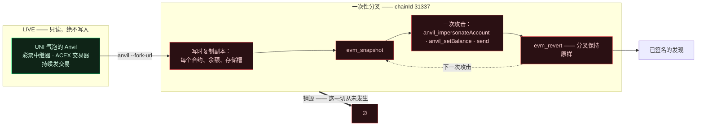
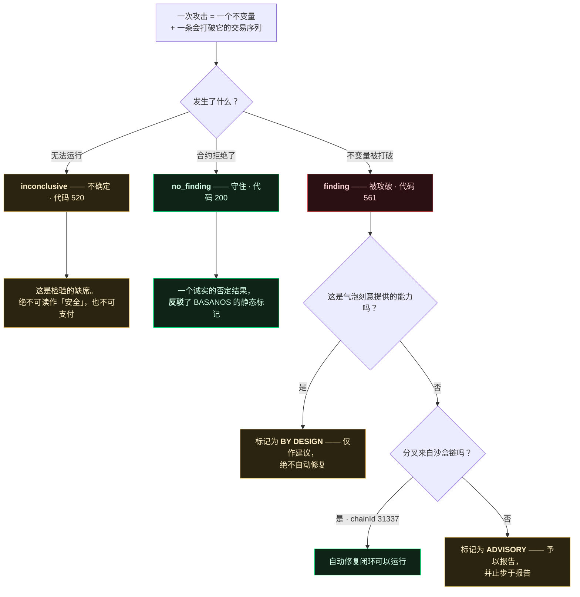
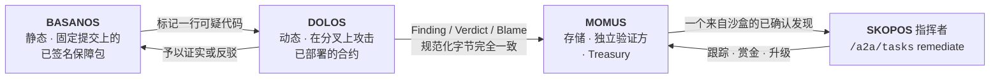
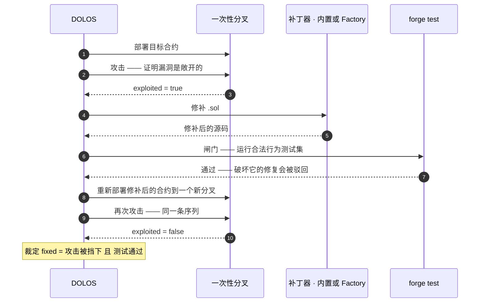

<p align="center"></p>

<h1 align="center">DOLOS —— 漏洞利用工匠</h1>

<p align="center">
  <strong>DOLOS</strong>（Δόλος）—— 希腊神话中的诡计与欺诈之灵。<br>
  面向 UNI 气泡的动态 EVM 攻击平台：它攻击已部署的合约，证明哪些缺陷真实存在——并且仅在沙盒链上，
  把修复推进到重新测试后的重新部署。
</p>

<!-- aicom-readme-badges -->
<p align="center">
  <a href="https://github.com/alexar76/dolos/actions/workflows/ci.yml"></a>
  <a href="https://dolos.modelmarket.dev/"></a>
  <a href="https://alexar76.github.io/dolos/"></a>
  =3.11" />
  
  
  
  
  <a href="https://github.com/alexar76/dolos/blob/main/LICENSE"></a>
</p>
<!-- /aicom-readme-badges -->

<p align="center">
  🌐 <a href="README.md">English</a> ·
  <a href="README.ru.md">Русский</a> ·
  <a href="README.es.md">Español</a> ·
  <a href="README.fr.md">Français</a> ·
  <strong>中文</strong>
</p>

**Capability：**`agent.security.contract-redteam@v1` · **运行目标：** UNI 气泡的 Anvil
（`chainId 31337`）· **姊妹层：**[BASANOS](../basanos)（静态保障）·
[MOMUS](../momus)（面向 HTTP/联邦的红队）

---

## 目录

- [为何攻击一切都安全](#为何攻击一切都安全)
- [什么是一次攻击](#什么是一次攻击)
- [三种结果](#三种结果)
- [可直接接入流水线的发现](#可直接接入流水线的发现)
- [完整的自动修复闭环](#完整的自动修复闭环)
- [安全边界——以及为何在 UNI](#安全边界以及为何在-uni)
- [用法](#用法)
- [周期扫描，以及一份记忆](#周期扫描以及一份记忆)
- [配置](#配置)
- [测试](#测试)
- [可选的 LLM](#可选的-llm--以及它不被允许碰的东西)
- [外部情报](#外部情报--从-basanos-读取绝不在这里自行抓取)
- [依赖](#依赖)
- [免责声明](#免责声明)

---

## 为何攻击一切都安全

测试合约最直观的做法，是向实时链发起漏洞利用，再用 `evm_revert` 回滚。在 UNI 气泡里这是错的：它的
Anvil 是**共享的**——彩票中继器和 ACEX 交易器持续在上面发交易，一次回滚会悄无声息地抹掉它们真实的活动。

所以 DOLOS 从不触碰实时链。它启动**自己的** `anvil --fork-url <live>`：实时状态的写时复制副本。每个
已部署的合约、每个余额、每个存储槽都可供攻击——用 `anvil_setBalance` 充入假以太，用
`anvil_impersonateAccount` **以任意地址的身份**驱动——而当分叉被销毁时，其上发生过的一切从未存在过。



整套设计都建立在这条性质上：**攻击任何东西，不承担任何风险**——因为目标是分叉，不是气泡，更绝不是一条
真实的链。

| Cheat code | 它带来什么 | 为何在这里是安全的 |
|---|---|---|
| `anvil --fork-url` | 实时状态的写时复制副本 | 目标是副本；气泡不受触碰 |
| `evm_snapshot` / `evm_revert` | 攻击之间免费且彻底的回滚 | 一次性的是分叉，而非气泡 |
| `anvil_impersonateAccount` | 无需私钥即可**以**所有者或受害者的身份交易 | 在真实链上不可能——这正是要点 |
| `anvil_setBalance` | 为任意地址充入假以太作 gas | 一切都不真实，也都不会比分叉活得更久 |

## 什么是一次攻击

不是「调用一个函数看看会怎样」，而是合约所声称的一个**不变量**，以及一条会打破它的具体交易序列：

| 攻击 | 不变量 | 在真实的 UNI 合约上 |
|---|---|---|
| `unauthorized_token_mint` | 供应量只能通过授权铸币者增长 | **守住** —— FakeUSDT 仅在构造函数中铸币 |
| `escrow_channel_hijack` | 已开启的通道 id 不能被另一个调用者重新开启 | **守住** —— `depositor != 0` 守卫拒绝了它 |
| `lottery_operator_bypass` | 只有 `OPERATOR_ROLE` 可以开启回合／提取手续费 | **守住** —— `onlyRole` 得到强制执行 |

每次攻击都从 Foundry 的构建产物中读取自己的 ABI，因此它发出的每一次调用，都是已部署合约真正暴露的调用。
ABI 缺失会让该次攻击变为**不确定**——绝不使用臆造的接口，也绝不默认判为通过。

## 三种结果



诚实的否定结果，正是 DOLOS 与 BASANOS 并存的理由。BASANOS（静态）标记*「任何调用者都可以写入
`channels[<caller id>]`」*；只有真的尝试劫持并被回滚，才能证明这个标记是真实的漏洞还是误报。在实时的
UNI 合约上，DOLOS **反驳**了正是这个标记：它尝试了劫持，守卫守住了，它如实报告。

## 可直接接入流水线的发现

一个 DOLOS 发现，与 [MOMUS](../momus) 探测所发出的，是同一种签名文档——AWR 形态的三元组
**Finding / Verdict / Blame**，在规范化、紧凑、排序后的 JSON 形式上用 Ed25519 签名。由于规范化字节完全
一致，它可以直接落入 MOMUS 的存储、验证器与 Treasury。



去重键仅由 `target + probe + category + status_code` 推导——刻意**不**包含响应内容——因此无论重扫多少次，
同一个缺陷都不会被支付两次。

签名遵循生态的职责分离：**扫描器**密钥签署发现，**另一把**验证方密钥签署裁定，而两者都不是放款的
Treasury 密钥。安装了 `oracle-core` 时，DOLOS 使用生态的规范 Ed25519 签名器；没有安装时，一个基于
`cryptography` 的本地签名器产出完全相同的字节。

## 完整的自动修复闭环

全程都在一个一次性沙盒分叉上——**不重新部署基础设施**：只有那一个合约被重新部署，部署到一个随后被丢弃的
分叉上：



已在 **DolosCanary** 上端到端证明——一个为被攻破而生的金库（如同 MOMUS 与 PRAXIS 的金丝雀）：一个陌生人
取走了自己从未存入的 5 ETH；修复者插入余额守卫；`forge test` 保持通过（会破坏合法提现的修复会被驳回）；
重新部署后的合约拒绝了同一次取款；裁定 `fixed`。真实的 UNI 合约都守住了，因此它们没有什么需要修复——这是
正确的结果，而不是空白。

修复者是可插拔的：**内置补丁器**施加确定性的守卫；也可以设置 `DOLOS_FACTORY_FIX_URL`，让 **Factory**
生成补丁。Factory 宕机、沉默或原样返回输入，都绝不会阻塞闭环——内置补丁器会接手。一个已确认的发现可以交给
SKOPOS 修复指挥者的 `/a2a/tasks` skill，也就是 MOMUS→SKOPOS→Factory 自愈闭环已经在用的那个入口。

## 安全边界——以及为何在 UNI

自动修复与重新部署**仅**允许在沙盒链的分叉上（`chainId` 取自 `DOLOS_SANDBOX_CHAIN_IDS`，默认
`31337`）。对一个真实且不可变的主网合约，系统绝不做任何自动改动：同样的发现在那里**仅作建议**，在文档中
被如此标记，并止步于报告。

这正是这套平台生活在 UNI 的全部原因——链是一次性的，所以修复闭环既免费又可逆。在 Base 主网上，同样的代码
会是一个严重缺陷和一次告警，绝不会是一次部署。

## 用法

```bash
# scan：分叉实时的 UNI anvil，跑完攻击目录，打印已签名的发现
python -m dolos scan --fork-url http://127.0.0.1:8545 --key data/dolos_scanner_key

# 只要漏洞利用，丢弃诚实的否定结果
python -m dolos scan --only-exploits

# canary：在一次性 anvil 上跑完整的 攻击→修复→重测→重新部署→再次攻击 闭环
python -m dolos canary --standalone

# canary 改用 Factory 补丁器，而非内置的
DOLOS_FACTORY_FIX_URL=http://factory/api/remediation/solidity python -m dolos canary --standalone

# 修复一个已确认的发现；裁定由一把**独立的**验证方密钥签署
python -m dolos fix --finding out/finding.json --verifier-key data/dolos_verifier_key
```

退出码：

| 命令 | `0` | `1` | `2` |
|---|---|---|---|
| `scan` | 合约都守住了 | 发现了一个**非设计使然的**漏洞利用 | 无法运行——没有分叉，也就没有裁定 |
| `canary` / `fix` | 漏洞已被封堵 | 未被封堵 | — |

`2` 与 `0` 刻意区分开：「我们根本没能连上链」绝不能被读作「一切正常」。

## 周期扫描，以及一份记忆

在此之前，整个仓库里没有任何东西会调度一次合约扫描 —— 没有定时器、没有 cron、没有间隔循环 —— 所以监控
节点显示的只是最后一次手工运行留下的东西。BASANOS 和 MOMUS 同样没有调度器；这是第一个。

```bash
# 推荐：由 systemd 定时器执行「一个周期」然后退出 —— 泄漏的分叉只损失一个周期，而不是守望者本身
sudo dolos/deploy/install-timer.sh --interval hourly

# 或者一个长驻循环，适合笔记本或没有定时器的容器
python -m dolos watch --interval 3600 --memos data/attack_memos.jsonl
```

`--memos PATH` 给 DOLOS 一份关于自身历史结果的记忆。它**只能重排目录顺序**，让一个周期把预算花在产出
真实存在的地方。它不能新增攻击、不能删掉攻击、也不能改变裁定 —— 每个攻击依然每个周期都跑，而历史对
「分叉实际做了什么」没有投票权。排序不是过滤：一个不再运行的攻击会悄悄变成未经检验的不变量，却被当作
已检查过来上报。

它编码的那个坑：UNI 稳定币的开放铸币在**每一次**运行中都是 `exploited=True`，因为那是气泡刻意提供的
水龙头；若按漏洞原始计数排序，它会被永久钉在第一位，把可能真正发现问题的攻击挤到后面。产出**只**计入
未被标记为 by-design 的发现。

| 变量 | 默认值 | 作用 |
|---|---|---|
| `DOLOS_WATCH_INTERVAL_S` | `3600` | 周期间隔秒数（下限 `30`）。 |
| `DOLOS_MEMO_PATH` | *(未设置)* | 记忆日志。未设置即无记忆，行为与之前逐字节一致。 |

`watch` 在 stdout 上每周期输出一行 JSON（因此 `dolos watch | jq` 可用），收尾摘要输出到 stderr。若
没有任何一个周期真正完成过扫描，它以 `1` 退出：一条长期不可达的链不该以 `0` 退出、被读成健康的守望者。

## 配置

| 变量 | 默认值 | 作用 |
|---|---|---|
| `DOLOS_FORK_URL` | `http://127.0.0.1:8545` | 待分叉的**实时**链的 RPC |
| `DOLOS_REALM` | `uni` | 读取哪个 realm 的地址簿 |
| `DOLOS_ADDRESS_BOOK` | — | `universe_config.json` 的显式路径 |
| `DOLOS_SANDBOX_CHAIN_IDS` | `31337` | 允许运行修复闭环的 chain id |
| `DOLOS_SIGNING_KEY_PATH` | — | 扫描器 Ed25519 密钥；没有它发现将不带签名 |
| `DOLOS_VERIFIER_KEY_PATH` | — | 用于修复裁定的**独立**验证方密钥 |
| `DOLOS_FACTORY_FIX_URL` | — | Factory 的补丁修复端点 |
| `DOLOS_CONDUCTOR_URL` | — | SKOPOS 指挥者；没有它则不提交任何东西 |
| `DOLOS_CONDUCTOR_PEER_TOKEN` | — | A2A 令牌（回退到 `SKOPOS_A2A_TOKEN`） |
| `DOLOS_LAST_SCAN_PATH` | `/app/data/universe/dolos_last_scan.json` | Alien Monitor 节点读取的产物文件 |
| `DOLOS_ANVIL_BIN` / `DOLOS_FORGE_BIN` | 取自 `PATH` | Foundry 二进制 |

## 测试

```bash
pip install -e '.[dev,signing]'
pytest                     # 配置与覆盖率门槛都来自 pyproject.toml
```

装有 Foundry 时：**233 个测试 · 96% 分支覆盖率**；没有 Foundry 时为 **92%**，因为
`tests/test_smoke.py` 中的集成测试会在缺少 `anvil`/`forge` 时自行跳过，并带走 `ForkChain` 的进程管理部分。
门槛（`--cov-fail-under=90`）在两种配置下都能通过，因此只装了纯依赖的笔记本仍能跑出一套有意义的测试。

单元测试只伪造两样东西——分叉的 cheat code，以及 web3 的合约对象——因此每一个*判断*都能在没有链的情况下被
检验：哪个不变量被打破、发现说了什么、什么可以自动修复。这覆盖了一次全绿的端到端运行永远看不到的路径：

- 在目录中途崩溃的攻击结果为**不确定**，并且不会中止扫描；
- 让 `forge test` 变红的修复会被**驳回**，而不是被发布；
- 无法被攻破的金丝雀会**中止**闭环，而不是宣称完成了修复；
- 以错误、500 或干脆不回应的节点会触发 `ForkError`——是「无法运行」，绝不是「合约是安全的」；
- 无法连通的 Factory、无法连通的指挥者以及损坏的响应都会被如实报告，绝不会被吞成虚假的成功。

## 外部情报 —— 从 BASANOS 读取，绝不在这里自行抓取

[攻击记忆](#周期扫描以及一份记忆)是*内生的*：它学到的是 DOLOS 自己的哪些攻击有产出，对于世界刚刚发现的
某一类弱点则什么也说不了。情报是另一半 —— 并且刻意**不是**第二条订阅源。

```bash
export DOLOS_INTEL_URL=http://basanos:9470
python -m dolos intel        # BASANOS 知道什么，以及 DOLOS 对什么还没有攻击
python -m dolos scan         # 同一份情报会重排这次扫描
```

BASANOS 已经在主机白名单之后拉取 OSV（`@openzeppelin/contracts`、`solmate`）与 GHSA，并把每条公告蒸馏
到它那套封闭的类别集合上。在这里再放一个抓取器，意味着第二份要维护正确的白名单、第二套速率限制，以及
第二个可能把公告处理错的地方 —— 而这些数据 BASANOS 已经核过了。它同时也把分层边界摆正了：**BASANOS
读源码并标记一个类别；DOLOS 攻击已经部署的东西，弄清这个类别是否真的可达。** 针对我们合约所导入的库的
一条公告，恰恰是 BASANOS 无法回答的问题。

### 注入路径并不存在

公告是陌生人写的、不可信的文本。显而易见的做法 —— 通过读卡片标题和摘要来给攻击排序 —— 会把攻击者可控的
文字放在决定 DOLOS 行为的路径上。这个面在这里不是被守住了，而是**根本不存在**：

> 排序**只**读取 `category_scores` —— 由 11 个取值的封闭枚举索引的数字 —— 从不读取标题、摘要、url 或
> 标识符。

卡片文本只为展示和 `propose` 而携带，并在输出时被净化。`tests/test_intel.py` 用两个数字完全相同、文本
天差地别的快照钉住了这一点（其中一个带着 `IGNORE PREVIOUS INSTRUCTIONS…`）：它们的排序必须一致，一旦有人
「改进」排序去读文本，测试立刻失败。

### 一张卡片能做什么 —— 以及它转而报告什么

一张卡片可以把已有攻击的优先级抬高一个**有上限的**幅度（`MAX_BOOST` 是封顶而非累加，好让某一类别的公告
洪水无法压过 DOLOS 对自身攻击真正*测量*出来的结果）。它不能新增攻击、删除攻击、改变裁定，也不能把一个
从未运行过的攻击挤下第一位。

真正新的信息是**空白**：一个热门类别，而目录里没有对应的攻击。

```
reentrancy      0.61   -> no attack in the catalog covers this class
delegatecall    0.44   -> no DOLOS attack category maps to this class
```

这正是 [`dolos propose`](#可选的-llm--以及它不被允许碰的东西) 存在的意义 —— 把它变成一个经过评审的候选。
空白只被报告，绝不自动填补：目录保持关闭，攻击仍旧由人来写。

| 变量 | 默认值 | 作用 |
|---|---|---|
| `DOLOS_INTEL_URL` | *(未设置)* | BASANOS 的基础 URL。未设置即没有情报；DOLOS 在完全没有 BASANOS 时也能工作。 |

无法连通的 BASANOS 会得到一个空快照，并让排序保持记忆留下的样子 —— 情报绝不会只应用一半。

## 可选的 LLM —— 以及它不被允许碰的东西

DOLOS 的裁定来自分叉实际做了什么：一次 revert、一笔被抽干的余额、一个收据状态。模型无法让一次 revert
变得更真或更假，所以**模型对裁定没有发言权**，也无法让目录生长。它只有两个纯咨询性的角色：

```bash
# 1. EXPLAIN —— 为一条已经有裁定的发现生成文字（裁定是输入，绝不是输出）
python -m dolos explain --finding out/finding.json

# 2. PROPOSE —— 从合约源码提出候选攻击，进入一个惰性的评审队列
python -m dolos propose --source contracts/evm/src/AIMarketEscrow.sol
```

**提案是惰性的。** 它们是写给人看的便条：不注册、不执行、不计数。把一条提案变成攻击，意味着有人写下代码、
读过那条序列并提交它 —— 目录保持关闭，理由与[攻击记忆](#周期扫描以及一份记忆)只能重排顺序完全相同。一个
靠自己的建议来扩张自身攻击面的扫描器，是没人能审计的扫描器，而它的第一个 `exploited=true` 将与真实的
无从分辨。

**这条边界是结构性的，不是一句承诺。** `attacks.py`、`harness.py`、`forkchain.py`、`findings.py`、
`fixloop.py`、`memos.py` 与 `submit.py` 无法 import `llm.py`，一旦改变 `tests/test_llm.py` 就会失败。
一个无法导入模型的模块，也就无法被模型影响。这也是为什么 `explain` 是运营者手动调用的命令，而不是扫描
过程会去调的东西：周期循环必须在网络不通时照样工作。

| 变量 | 默认值 | 作用 |
|---|---|---|
| `DOLOS_LLM_PROVIDER` | `offline` | `offline` · `openrouter` · `deepseek` · `anthropic` · `openai` · `ollama` · `lmstudio` |
| `DOLOS_LLM_MODEL` | 随提供方 | 覆盖预设模型。 |
| `DOLOS_LLM_API_KEY` | — | 回退到 `OPENROUTER_API_KEY` / `DEEPSEEK_API_KEY` / `ANTHROPIC_API_KEY`，再到 `DOLOS_LLM_API_KEY_FILE`。 |
| `DOLOS_PROPOSAL_QUEUE` | `data/attack_proposals.jsonl` | 惰性队列。 |
| `DOLOS_LLM_MAX_TOKENS` | `6000` | 输出预算。**推理模型会在产出前先把它花掉**：设为 1200 时，`minimax/minimax-m3` 与 `deepseek-v4-pro` 会返回 HTTP 200 但 content 为空，并无声降级。现在降级会说明原因（`truncated…` 对比 `HTTP 401`），而不是看起来像服务不可用。 |

生产设置是 **OpenRouter + `minimax/minimax-m3`** —— 与工厂已经在跑的 base URL 和模型 id 一致
（`llm/persist_openrouter.py`），这样卫星不会漂移到自己的一套上：

```bash
export DOLOS_LLM_PROVIDER=openrouter   # OPENROUTER_API_KEY 会被自动取用
```

默认仍是 `offline`：确定性、不开套接字、不需要密钥，因此整套测试在没有任何可达模型的环境下也能跑完。
未知的提供方、失效的端点、无法解析的回复，都会退化到这条路径，而不是让命令失败：这一层是咨询性的，而
咨询性的东西绝不该变成承重的。没有新增依赖 —— 它通过 `urllib` 说 HTTP，和 `submit.py` 已有的方式一样。

## 依赖

Foundry（`anvil`、`forge`）与 `web3`；`oracle-core` 提供规范的 Ed25519 签名器（缺失时使用基于
`cryptography` 的本地签名器）。当没有可用的签名后端时，发现将不带签名——仍然可读，只是无法通过流水线获得
支付。

## 免责声明

DOLOS 是一款**用于安全研究的红队工具**，用于在你所控制的**一次性沙盒分叉**上测试**你自己的**智能合约。
它不得用于你并不拥有、或未获授权测试的系统；那样做可能违法。它的攻击性能力（冒充身份、铸币、抽干资金、
漏洞利用交易）在这里之所以安全，只是因为目标是本地 Anvil 的一次性分叉，而绝非一条真实的链。来自非沙盒链
分叉的发现**仅作建议**，绝不会被自动修复。本工具按**「原样」提供，不作任何形式的担保**（MIT）；使用责任
由运营者承担。

MIT。AIMarket 生态的一部分；只针对 UNI 沙盒运行，绝不针对生产链。
